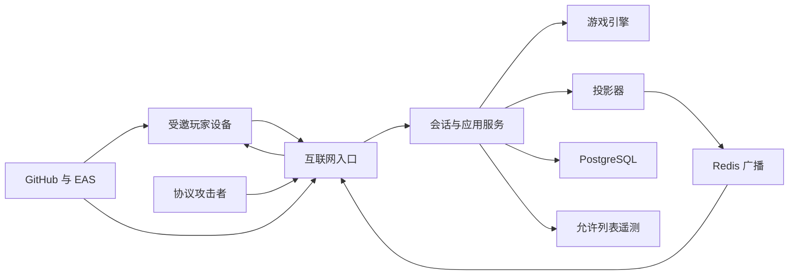

# Avalon MVP 安全威胁模型

> 状态：P0 设计阶段威胁模型
>
> 日期：2026-08-13
>
> 适用版本：邀请制测试 MVP / `CLASSIC_AVALON_V1`
>
> 重要限制：仓库目前只有规范、ADR 和 bootstrap Schema，没有实现代码。本文中的“已规定控制”尚未经过代码或部署验证，不等于已实施控制。

## Executive summary

最高风险集中在三处：无账号 SessionToken 被盗或跨房间授权错误会让攻击者冒充玩家；个性化投影、错误或遥测过滤失误会泄漏角色与任务秘密；重复/并发命令和不可靠实时传输会破坏权威裁决。MVP 虽通过邀请分发，但 API/Socket.IO 是互联网公开、多租户边界，获得安装包或协议知识的用户应视为完全不可信。终局数据不提供历史查询，服务端必须在结果投递后主动清除，而不是沿用原先 24 小时保留假设。

## Scope and assumptions

### 范围

当前审查范围是设计与协议：

- `AGENTS.md`；
- `docs/game-rules.zh-CN.md`；
- `docs/server-state-machine.zh-CN.md`；
- `docs/mobile-fr-nfr.zh-CN.md`；
- `docs/architecture/`；
- `docs/api-contract.zh-CN.md` 与 `docs/contracts/`；
- `docs/ux-spec.zh-CN.md`、`docs/test-strategy.zh-CN.md`、`docs/roadmap.zh-CN.md`。

实现后范围扩展到 `apps/mobile`、`apps/server`、`packages/game-engine`、`packages/protocol`、基础设施配置、CI/EAS 和第三方 SDK。

### 已由所有者确认

- MVP 通过邀请制测试分发，未来才考虑 App Store/Google Play 公开发布；
- 后端仍是互联网公开、多租户服务，承载彼此无关的房间；
- 首个部署区域为澳大利亚；
- MVP 没有运营后台，人工客服不能访问房间数据；
- 不提供对局历史；终局结果只属于当前结束体验，服务器不以产品功能目的保留已结束对局；
- 玩家没有账号，只使用昵称、房间号和高熵设备会话令牌。

### 明确不在本次范围

- 远程聊天、麦克风录音、UGC、好友/匹配、支付、广告和账号恢复；
- 商店公开发布后的大规模反滥用和未成年人合规；
- 云供应商内部人员、国家级攻击者和已完全控制生产 KMS/数据库管理员的攻击；
- 玩家在线下口头泄密、主动把自己的手机交给他人或拍摄他人屏幕；这些是产品提示与现场行为风险，不视为服务器漏洞。

### 尚待 M0/M7 落定的问题

- 邀请分发采用 TestFlight、Play Internal/Closed testing 还是企业/临时分发；
- 具体云供应商、澳大利亚区域、WAF/限流与 KMS 能力；
- 云入口/供应商日志、数据库复制/WAL 的物理残留上限；应用限流键已规定为 HMAC 摘要且 TTL 不超过 10 分钟；
- Preview/生产签名、CI OIDC 和 secrets 管理方案。

这些问题会改变 DoS、供应链和删除残余的概率，但不会降低客户端、房间和玩家之间的授权要求。

## System model

### Primary components

| 组件 | 安全职责 | 证据锚点 |
| --- | --- | --- |
| Expo 移动端 | 安全保存 token、只渲染本人投影、私密页遮罩、固定音频 | `docs/architecture/README.md` 第 3 节；`docs/ux-spec.zh-CN.md` 第 4/8 节 |
| Fastify/Socket.IO 入口 | TLS 后的认证、Schema、大小/速率限制、命令确认 | `docs/architecture/ADR-002-server-runtime-hosting.md`；`docs/api-contract.zh-CN.md` 第 2–4 节 |
| 应用服务/投影器 | 操作者授权、幂等事务、逐玩家投影、错误过滤 | `docs/server-state-machine.zh-CN.md` 第 4/6/8 节；`docs/architecture/README.md` 第 3/5 节 |
| 纯游戏引擎 | 权限后的领域验证、确定性裁决、不变量 | `AGENTS.md` 第 2/5 节；`docs/server-state-machine.zh-CN.md` |
| PostgreSQL | 活跃聚合、token 摘要、去重、Outbox 和短期结果投递 | `docs/architecture/ADR-003-room-persistence-concurrency.md` |
| Redis | 跨实例广播、限流和连接租约，非权威状态 | `docs/architecture/README.md` 第 3 节；`ADR-003` |
| 可观测性 | 允许列表指标和匿名诊断，不含游戏秘密 | `docs/mobile-fr-nfr.zh-CN.md` `NFR-023`；`AGENTS.md` 第 5 节 |
| CI/EAS/依赖供应链 | 生成签名客户端和服务构建产物 | `docs/roadmap.zh-CN.md` M0/M7/M8；`ADR-005` |

### Data flows and trust boundaries

- **未认证互联网 → HTTP API**：昵称、房间号、配置、客户端能力和 Idempotency-Key 经 HTTPS；必须执行大小限制、Schema、Unicode 规范化、房间号模糊错误和组合限流。证据：`docs/api-contract.zh-CN.md` 第 2–3 节。
- **持有 token 的移动端 → HTTP/Socket.IO**：Bearer/handshake token、命令和版本跨互联网；TLS、token 摘要/轮换、逐命令授权、`commandId`、`expectedStateVersion` 和 Schema 提供控制。证据：协议第 2.4/4 节，状态机第 4 节。
- **Gateway → 应用服务/游戏引擎**：已解析但仍不可信的操作者意图进入权限与领域边界；不能信任客户端提供的 roomId、角色或 availableActions。证据：`AGENTS.md` 第 2/5 节。
- **应用服务 → PostgreSQL**：活跃角色、私密知识、命令/结果和 token 摘要进入持久化边界；短事务、房间行锁、Outbox、最小字段和终局清除是关键保证。证据：`ADR-003`。
- **应用服务/Outbox → Redis → Gateway**：投影发布和连接状态跨实例；Redis 不可成为唯一真相，重复消息由版本/事件 ID 去重。证据：`ADR-003`、`ADR-004`。
- **投影器 → 每条玩家连接**：同一聚合产生不同 `RoomView`，是最敏感的多租户/多玩家边界；必须以 token 绑定 PlayerId 构建，不能复用其他玩家序列化结果。证据：状态机第 6 节、`room-view.schema.json`。
- **运行时 → 日志/指标/崩溃平台**：错误、延迟和诊断跨到第三方/运维边界；只允许字段白名单，禁止 token、角色、票和昵称。证据：`NFR-014`、`NFR-023`。
- **开发者/GitHub/EAS → 商店/测试分发**：源代码、依赖、签名凭证和构建物跨供应链边界；MVP 邀请制限制分发，不构成后端认证。证据：`ADR-005`、Roadmap M0/M8。

#### Diagram

## Assets and security objectives

| Asset | Why it matters | Security objective (C/I/A) |
| --- | --- | --- |
| SessionToken 与 token family | 等同单个玩家身份，可提交秘密动作和读取本人角色 | C、I |
| 角色分配与私密知识 | 泄漏会直接破坏本局公平和产品核心承诺 | C、I |
| 未公开组队票与任务行动 | 提前/关联玩家泄漏会破坏推理；篡改会改变胜负 | C、I |
| 房间聚合、stateVersion、比分与 outcome | 权威裁决和恢复的唯一依据 | I、A |
| processed commands 与 Outbox | 防止重复效果并确保已提交状态可发布 | I、A |
| 房间号与加入能力 | 虽非秘密凭证，但枚举/分享可导致骚扰和占位 | I、A |
| 昵称、IP、随机安装标识 | 属于假名/网络标识，应最小化且不形成历史画像 | C |
| 音频/字幕资源 | 被替换会误导流程或播放不当内容 | I、A |
| 数据库/KMS/Redis/部署凭证 | 泄漏可扩大为全部活跃房间和服务控制 | C、I、A |
| 签名密钥、CI/EAS 构建与依赖 | 被篡改可向受邀设备分发恶意客户端 | C、I |
| 日志、指标和崩溃附件 | 容易成为绕过应用授权的秘密副本 | C、I |

## Attacker model

### Capabilities

- 获得或转发邀请构建，逆向客户端并直接构造 HTTP/Socket.IO 请求；
- 创建大量房间/连接、枚举 6 位房间号、分享/扫描恶意二维码；
- 控制自己的设备、token、时钟、网络顺序和断线时机，重放/并发发送命令；
- 作为某个合法玩家观察其全部网络载荷和本地存储；
- 与同桌一个或多个玩家串通，提供任意昵称和合法范围内配置；
- 利用公开依赖漏洞或获得泄漏的测试/CI 凭证。

### Non-capabilities

- 默认不能破坏正确配置的 TLS、猜中高熵 SessionToken 或直接访问私网数据库；
- 默认没有其他玩家已解锁设备、生产云管理员或签名账户权限；
- 不能仅凭房间号获得已加入玩家身份；房间号只允许尝试加入大厅；
- 不能在角色发放后合法加入、替补或取得房主权限；
- 邀请制降低随机互联网流量概率，但攻击者一旦获得构建即具有与公开客户端相同的协议能力。

## Entry points and attack surfaces

| Surface | How reached | Trust boundary | Notes | Evidence (repo path / symbol) |
| --- | --- | --- | --- | --- |
| `POST /v2/rooms` | 未认证 HTTPS | 互联网→API | 昵称、配置、资源消耗、幂等 | `docs/api-contract.zh-CN.md` 3.2；`SM-001` |
| `POST /v2/rooms/{code}/players` | 未认证 HTTPS/QR | 互联网→API/房间 | 枚举、占位、昵称输入 | 协议 3.3；`SM-002` |
| `POST /v2/sessions/resume` | Bearer HTTPS | token→会话 | token 重放、轮换竞态 | 协议 3.4；`SM-003` |
| `GET /v2/rooms/current/view` | Bearer HTTPS | token→投影 | 跨玩家/跨房间读取 | 协议 3.5；`room-view.schema.json` |
| Socket.IO handshake | 互联网长连接 | token→Gateway | 连接放大、旧 token、恢复旁路 | 协议 4.1；`ADR-004` |
| `command.submit` | 已认证 Socket.IO | 玩家→领域 | 伪造权限、重放、竞态、超大载荷 | `command.schema.json`；状态机 4.2–4.4 |
| `room.view` | Server→单玩家 | 投影器→租户/玩家 | 错接 socket 或缓存会泄漏秘密 | 状态机第 6 节；`ADR-004` |
| 昵称/暂停原因 | HTTP/命令输入 | 用户文本→UI/日志 | Unicode 欺骗、注入、日志污染 | 协议 2.3；`FR-001`、`SM-014` |
| 二维码/Universal Link | 相机/OS 深链 | 外部内容→移动路由 | 任意 URL、钓鱼、非法房间号 | `docs/ux-spec.zh-CN.md` 4.2；`NFR-013` |
| SecureStore/任务切换器 | 本地设备 | OS/其他应用→移动秘密 | token/角色本地泄漏、截图 | UX 4.5/8；`NFR-010`、`NFR-022` |
| 日志/指标/崩溃 SDK | 运行时异常 | 运行时→第三方 | 自动上下文采集秘密 | `NFR-014`、`NFR-023` |
| 依赖、CI 与 EAS | Git/包注册表/CI | 开发供应链→构建 | 恶意依赖、密钥和产物篡改 | Roadmap M0/M8；`ADR-005` |

## Top abuse paths

1. **窃取玩家会话**：攻击者从日志、深链、崩溃附件或不安全本地存储取得 token → 调用恢复轮换 → 原设备被撤销 → 攻击者读取角色并代为投票/任务，破坏本局保密与完整性。
2. **跨玩家投影混淆**：两个 Socket 复用错误的房间/玩家缓存键 → 投影器用请求中的 playerId 而非 token 绑定身份 → 玩家收到别人的 `selfRole/knownPlayers` → 整局秘密泄漏。
3. **并发最后一票双结算**：攻击者从多个连接以相同旧版本提交 → 两个实例在没有房间锁/去重原子性的情况下都通过 → 任务/队长/音频推进两次，比分或胜负损坏。
4. **日志成为秘密历史库**：故意提交非法任务动作或畸形载荷 → 框架记录请求体/错误对象 → token、角色或选择流入长期日志/崩溃平台 → 无运营后台的设计被旁路。
5. **枚举并占满大厅**：自动化遍历房间号 → 根据错误或时序识别活跃房间 → 使用不同 IP/安装 ID 加入并准备/占位 → 受邀玩家无法开始或遭到骚扰。
6. **连接/建房资源耗尽**：建立大量长连接和空房、频繁重连/握手 → 消耗实例、Redis、数据库连接和 Outbox → 所有测试房间无法满足实时 SLO。
7. **恶意 QR/昵称进入设备与日志**：制作非应用域深链或 Unicode 欺骗昵称 → 客户端打开外部内容/界面误认玩家，或日志解析被污染 → 钓鱼、误操作或告警失真。
8. **构建供应链接管**：依赖或 CI token 被攻破 → 恶意代码进入邀请构建 → 从 SecureStore 窃取 token/角色或将流量发往攻击者 → 所有安装测试包的房间受影响。
9. **终局数据未清除**：GAME_OVER 后房间聚合、Outbox、日志或备份仍可查询 → 攻击者/运维凭证泄漏后批量获得昵称、角色和历史 → 违反“不保留对局”的产品决定。
10. **同桌旁观侧信道**：任务成功/失败选择产生不同颜色、动画、触觉或停留时间 → 邻座不看屏幕正文也能推断邪恶选择 → 核心隐私被 UI 行为削弱。

## Threat model table

| Threat ID | Threat source | Prerequisites | Threat action | Impact | Impacted assets | Existing controls (evidence) | Gaps | Recommended mitigations | Detection ideas | Likelihood | Impact severity | Priority |
| --- | --- | --- | --- | --- | --- | --- | --- | --- | --- | --- | --- | --- |
| `TM-001` | 合法玩家/协议攻击者 | 持有任一有效 token；服务端授权或投影缓存键错误 | 改 roomId/playerId、复用 socket/序列化结果，读取或收到其他玩家投影 | 跨玩家/跨房间角色秘密泄漏，可操纵动作 | 角色、私密知识、任务行动、聚合 | 已规定身份从 token 得出、逐连接投影、客户端不得传 actor（状态机 4.1/6；`AGENTS.md` 2/5） | 尚无实现、投影允许列表或多租户代理测试 | 应用服务 API 只接收 `SessionContext`；禁止 handler 接受 actorPlayerId；投影不共享含私密字段的缓存；每次发送断言 recipient；8 角色×阶段×两房差分测试 | 记录无载荷的 authZ mismatch、recipient assertion、跨房 roomId 计数并告警 | 中：典型对象级授权/缓存风险，但架构已明确边界 | 高：一次泄漏即可毁掉多房公平，若跨租户则范围扩大 | high |
| `TM-002` | 本地恶意应用、日志读者、网络/CI 攻击者 | token 被写入非安全存储、URL、日志或第三方 SDK；或恢复轮换不原子 | 盗用/重放 token，先于原设备轮换并冒充玩家 | 读取本人秘密、提交不可逆动作、阻断原玩家 | SessionToken、角色、游戏完整性 | 已规定 128 位熵、SecureStore、摘要存储、TLS、恢复轮换（协议 2.4；`NFR-010/012`） | 无 token family 实现、设备清理/日志 SDK 配置和并发恢复测试 | 256-bit opaque token；服务器只存带 pepper 摘要；单事务轮换与旧 token 撤销；日志 header/body redaction；移动端禁止 AsyncStorage/URL；异常轮换二次限制 | token family 并发轮换、旧 token 重放、会话设备变化只记类别不记 token/IP 原值 | 中：猜测不现实，但 SDK/日志误收集常见 | 高：等同玩家账户且不可人工恢复 | high |
| `TM-003` | 合法/恶意玩家 | 可建立多个连接并控制重试/顺序；事务边界或去重实现不完整 | 重放、改载荷复用 ID、并发最后提交或伪造房主/队长/刺客动作 | 重复结算、比分/胜负错误、越权主持 | 聚合、processed commands、outcome、可用性 | 已规定 `commandId`、请求摘要、版本、房间行锁、同事务自动裁决（状态机 4.2；`ADR-003`） | 尚无 DB 约束、故障点测试和系统命令竞态验证 | `processed_commands(room_id, command_id)` 唯一约束；锁后再验版本；响应/Outbox 同事务；所有系统命令使用相同执行管线；有限死锁重试 | duplicate conflict、stale spike、每版本多 outcome/outbox 不变量、锁等待告警 | 中：攻击者可轻易制造，成功依赖实现缺陷 | 高：权威裁决是核心资产 | high |
| `TM-004` | 框架默认行为、开发者、第三方 SDK | 请求/状态/异常对象被通用记录或上传 | 通过错误路径把 token、角色、未公开票或任务行动写入日志/崩溃/分析 | 秘密形成跨房、长生命周期副本 | 游戏秘密、token、昵称、隐私承诺 | 已规定字段允许列表和禁止项（`NFR-014/023`；`AGENTS.md` 5；测试策略 5/10） | 尚未选 SDK/日志管线；框架默认序列化可能绕过 | 禁止请求体/Authorization 自动日志；结构化允许列表 logger；生产 sourcemap 与附件访问控制；CI/Preview canary secret 扫描；第三方 SDK privacy review | canary 值扫描、日志 schema 拒绝计数、SDK 出站代理测试 | 中：错误处理和 SDK 默认采集常见 | 高：可绕过所有游戏投影控制并延长保留 | high |
| `TM-005` | 自动化外部用户/邀请泄漏者 | 后端互联网公开且无账号；能分散 IP/安装 ID | 枚举房间号、区分错误/时序、占据大厅或反复创建房间 | 骚扰受邀测试者、阻塞开始、消耗容量 | 房间加入能力、可用性、昵称 | 30-bit 房间号、通用错误、IP+安装标识限流、开局后不可加入（`NFR-013`；协议 3.1） | 30-bit 不是访问凭证；邀请分发不可阻止直接协议调用；分布式绕限流 | 邀请测试期增加可轮换的 app-level beta access token/attestation 作为外层门；创建/加入分层速率和并发房间配额；统一不存在/不可加入响应；房主大厅移除 | 房间号失败分布、创建/加入漏斗、同网段/安装族异常，不记录长期原始 IP | 中：邀请限制流量，但分享/逆向容易 | 中：主要影响单房/测试服务，不泄漏已发牌秘密 | medium |
| `TM-006` | 互联网 DoS、错误客户端 | 可建立长连接、创建空房和频繁重连 | 耗尽实例、连接池、Redis、数据库锁或 Outbox | 全服务不可用，对局暂停/过期 | API/Realtime/DB 可用性、活跃聚合 | 已规定载荷上限、速率、10 秒暂停、目标压测与水平扩展（协议 2.1/4.2；`NFR-004/005`） | 尚无入口/WAF、每 IP/会话/房间配额和过载策略 | 握手与未认证端点独立限流；全局连接预算；每房命令队列上限；DB pool backpressure；优先保护活跃已认证房间；滚动排空和容量告警 | 连接/实例、握手失败、DB pool、event-loop lag、Outbox age、房间创建率 | 中：互联网可达，但邀请测试降低动机/规模 | 高：会中断所有进行中房间 | high |
| `TM-007` | 恶意玩家/二维码制作者 | 能提供昵称、暂停原因或 QR | Unicode 欺骗、控制字符、恶意深链、超大/畸形 Schema | 误认玩家、外部钓鱼、客户端崩溃、日志污染 | UI 完整性、可用性、可观测性 | 已规定 NFC/控制字符拒绝、受控 host/path、严格 Schema/未知字段拒绝（协议 2.3；UX 4.2；`ADR-007`） | grapheme/双向字符实现和所有渲染上下文未验证 | 使用成熟 Unicode grapheme 库；拒绝 bidi controls；React Native 文本不解释 markup；deep link allowlist；扫码不自动打开；Schema fuzz/大小限制 | validation code 分布、非法 deep link 计数、客户端 crash 版本关联 | 中：输入完全可控 | 中：通常单设备/单房影响，链到注入才扩大 | medium |
| `TM-008` | 恶意依赖维护者、CI/EAS 凭证窃贼 | 依赖/Action 未固定或长期凭证泄漏 | 篡改构建、注入 token/角色外传代码、替换音频 | 所有受邀设备和活跃房间被接管 | 签名、构建、token、角色、服务凭证 | 已规定锁文件、EAS profiles、人工生产门槛、secret scan（`AGENTS.md` 3/8；Roadmap M0/M8） | 尚无 CI、OIDC、provenance、review/签名策略 | 固定依赖和 GitHub Actions commit SHA；最小权限 OIDC 短凭证；环境保护；依赖审查；可复现构建/产物哈希；签名密钥不进 repo/普通 CI | 依赖 diff、构建 provenance、异常 EAS 登录/签名、产物网络目的地审查 | 低：需要供应链或凭证突破 | 高：影响所有测试者并可盗取秘密 | medium |
| `TM-009` | 配置错误、DB/日志/备份读者 | GAME_OVER 后清理失败，或副本/Outbox/备份仍保存 | 查询/恢复已结束对局、昵称、角色或任务公开历史 | 违反无历史决定，扩大未来基础设施泄漏范围 | 昵称、角色、聚合、隐私承诺 | 已实现在线会话冻结、终局投影前收据、全部 ACK 立即级联删除、60 秒兜底删除、无终局恢复/查询接口和客户端安全存储清理（`ADR-003`；`NFR-016`） | 应用层已覆盖并有并发/受控时钟测试；WAL、复制、长期备份和供应商日志的物理残余上限仍须在邀请测试前由目标基础设施验证 | 暂态表排除长期备份；部署前明确复制/WAL/供应商日志残余上限；增加删除合成 canary 与告警 | terminal-to-delete 延迟 SLI、过期行数、删除失败告警、备份内容抽检 | 中：多存储副本和失败任务容易造成残余 | 中：假名和游戏秘密，不含账号/支付，但明确违反承诺 | medium |
| `TM-010` | 同桌旁观者、录屏/系统预览 | 玩家在私密操作时被观察；UI 行为因选择不同 | 通过屏幕、预览、动画、触觉或停留时间推断身份/选择 | 单局秘密泄漏和现场争议 | 角色、任务行动、投票 | 已规定隐私门、后台遮罩、提交后中性态、等价动画/触觉（UX 4.5/4.9/8） | 平台截图能力不同，无法阻止主动分享；尚无真机侧信道检查 | Android 私密页截图保护作为纵深；iOS 录屏检测/遮罩；成功/失败等时反馈；默认低亮私密布局；明确现场提示；读屏仅显式揭示 | 不采集秘密选择遥测；以真机人工/录屏审查验证，不记录玩家行为 | 高：线下同桌天然可观察 | 中：影响当前一局，不能远程扩大 | medium |

## Criticality calibration

### Critical

无需账号即可远程控制服务或大规模跨租户读取全部活跃房间，且现有边界无法限制。例如：未认证 RCE；生产数据库/KMS 主凭证公开；签名与更新通道被接管并自动分发到全部用户。当前设计证据不足以认定存在 critical，但实现扫描必须查找。

### High

可现实利用并破坏一个或多个活跃房间的核心秘密/裁决，或中断整个测试服务。例如：用任一 token 读取其他玩家投影；重复最后一票改变 outcome；token 进入集中日志；连接洪泛使全部房间暂停。

### Medium

主要影响单房、单设备或违反低敏感度保留承诺，扩大需要额外条件。例如：枚举并占满大厅；恶意 QR/昵称造成钓鱼或崩溃；终局数据未按时删除；同桌旁观侧信道；需要先攻破 CI 的邀请构建篡改。

### Low

只泄漏非敏感、已公开元数据或造成容易恢复的噪声，且不能用于识别活跃房间或改变动作。例如：健康端点暴露粗粒度版本族；单一无效请求造成短暂本机提示；不含房间/玩家维度的公共延迟指标。

## Focus paths for security review

当前没有实现代码；下表将规范锚点与 M0 后必须重点审查的目标路径同时列出。

| Path | Why it matters | Related Threat IDs |
| --- | --- | --- |
| `docs/api-contract.zh-CN.md` | 认证、错误、幂等、实时恢复和限流的规范源 | `TM-001`–`TM-007` |
| `docs/contracts/` | 必须阻止未知/秘密字段跨边界 | `TM-001`、`TM-004`、`TM-007` |
| `docs/architecture/ADR-003-room-persistence-concurrency.md` | 事务、去重、Outbox 与删除生命周期 | `TM-003`、`TM-006`、`TM-009` |
| `apps/server/src/auth/` | token 摘要、轮换、撤销和 SessionContext（计划路径） | `TM-001`、`TM-002` |
| `apps/server/src/realtime/` | Socket 鉴权、重连、速率和逐连接发送（计划路径） | `TM-001`、`TM-003`、`TM-006` |
| `apps/server/src/projections/` | 最敏感的角色/玩家隔离点（计划路径） | `TM-001`、`TM-004` |
| `apps/server/src/outbox-worker.ts`、`apps/server/src/session-presence.ts` | 行锁、终局在线会话冻结、收据、ACK/超时清除 | `TM-003`、`TM-009` |
| `apps/server/src/observability/` | 日志/指标字段允许列表和 SDK redaction（计划路径） | `TM-002`、`TM-004` |
| `packages/game-engine/` | 权限后的确定性裁决和善方动作限制（计划路径） | `TM-003` |
| `packages/protocol/` | 运行时 Schema 和生成投影契约（计划路径） | `TM-001`、`TM-004`、`TM-007` |
| `apps/mobile/src/session/` | SecureStore、token 清理、终局内存保留和恢复 | `TM-002`、`TM-009` |
| `apps/mobile/src/features/private/` | 身份/任务/刺杀遮罩和侧信道（计划路径） | `TM-010` |
| `apps/mobile/app.config.*` | deep link、平台权限、截图/录屏和 EAS 配置（计划路径） | `TM-007`、`TM-008`、`TM-010` |
| `.github/workflows/`、`eas.json` | 供应链权限、签名和发布环境（计划路径） | `TM-008` |

## Mitigation milestones

| 时间 | 必须完成 |
| --- | --- |
| M0 | Schema 边界、token redaction、CI secret scan、依赖锁定、基础限流、无秘密日志骨架 |
| M1–M2 | SessionContext 授权、token 摘要/轮换、房间锁/去重/Outbox、两房差分契约测试 |
| M3–M6 | 全角色投影矩阵、后台遮罩、等时秘密动作、音频去重、终局投递与清除 |
| M7 Preview | 攻击面复扫、授权/枚举/DoS/日志代理测试、删除 SLI、供应链和 EAS 权限审查 |
| 未来公开发布前 | 重新建模账号/公开滥用/大规模 DDoS/未成年人和商店合规，不直接复用邀请测试评级 |

## M7 实现复核（2026-08-15）

- `TM-001/TM-002`：会话轮换使用单调 `credential_generation`；跨实例 Redis 通知立即撤销旧 Socket，命令、投影、终局 ACK 与续期再次核对代际。
- `TM-004`：移动 Sentry 使用 DE DSN 门槛和事件允许列表，禁用 breadcrumbs、截图、Replay、附件、用户与请求正文；无 DSN 时 SDK 禁用。
- `TM-005/TM-006`：创建/加入使用组合、独立可信 IP 和全局桶；握手在 PostgreSQL 查询前执行 IP、待认证、超时与连接预算。
- `TM-008`：基础镜像固定 tag+digest，CI 生成 OCI SBOM/provenance；EAS/云端凭证仍是人工门槛。
- `TM-009`：终局用同 eventId 每 2 秒重投至全部 ACK 或 60 秒清除；ACK 未命中不再取得房间锁。
- `TM-010`：根 AppState 中性遮罩覆盖所有路由；真机任务切换器与录屏证据仍待 iOS/Android 执行。

剩余风险：入口私网和覆盖转发头、真实 DDoS/WAF、Sentry DE 出站、供应商备份/WAL 残余、30 分钟容量与真机隐私/音频均需真实 Preview 人工验证；延期的无障碍要求不视为已缓解。

## Quality check

- [x] 覆盖了当前规范中发现的 HTTP、Socket.IO、QR、移动本地、存储、遥测和供应链入口；
- [x] 每个主要信任边界至少出现在一个威胁与缓解路径中；
- [x] 区分运行时系统、移动设备、CI/EAS 与测试工具；
- [x] 反映所有者确认的邀请制、互联网多租户、澳大利亚区域、无后台和无历史；
- [x] 区分已由 M0–M5 实现并验证的应用控制，以及仍需部署/基础设施证据的控制；
- [x] 标记会影响风险评级的云、分发、日志和物理残留开放问题；
- [x] 没有假设房间号是认证凭证，也没有把邀请分发当作可信客户端边界。
