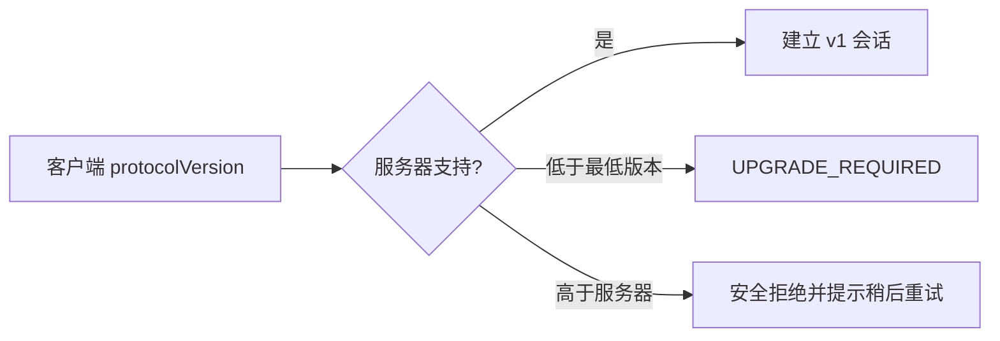

# Avalon HTTP 与实时协议契约 v1

> 状态：P0 bootstrap 基线
>
> 协议版本：`1`
>
> 规则版本：`CLASSIC_AVALON_V1`
>
> 依赖：[状态机规范](./server-state-machine.zh-CN.md) · [Schema 目录](./contracts/README.md) · [ADR-004](./architecture/ADR-004-realtime-protocol.md) · [ADR-007](./architecture/ADR-007-contract-source-of-truth.md)

## 1. 目的与边界

本文把状态机的概念模型转换为移动端可调用的传输契约，定义 HTTP 路径、Socket.IO 事件、认证、幂等、重连、错误和兼容性。JSON 的规范字段以 `docs/contracts/*.schema.json` 为准；游戏阶段、权限和裁决以前述状态机为准。

服务根地址用 `{apiBaseUrl}` 表示，示例生产协议必须为 HTTPS/WSS。实际域名和部署供应商尚未决定。

## 2. 通用约定

### 2.1 传输与编码

- HTTP 只接受/返回 `application/json; charset=utf-8`；
- 请求体上限 32 KiB，Socket.IO 单消息上限 64 KiB；超过返回 `PAYLOAD_TOO_LARGE`；
- 时间使用 UTC RFC 3339/ISO 8601；标识使用 UUID；
- HTTP 和实时响应不得设置会话令牌到 URL、Cookie、可公开缓存或日志；
- 所有响应设置 `Cache-Control: no-store`，加入链接页面本身除外；
- 未声明字段拒绝，不做静默忽略或客户端字段透传；
- 客户端展示文案由本地 `ErrorCode` 映射，不直接展示服务器 `message`。

### 2.2 请求标头

| 标头 | 使用范围 | 规则 |
| --- | --- | --- |
| `Authorization: Bearer <SessionToken>` | 恢复、读取投影 | 必需；值不得出现在日志 |
| `Idempotency-Key: <UUID>` | 创建、加入、恢复 | 必需；同键同请求返回首次响应，同键异请求报冲突 |
| `X-Protocol-Version: 1` | 全部 `/v1` 请求 | 必需；不兼容返回 `UPGRADE_REQUIRED` |
| `X-Request-Id: <UUID>` | 可选 | 客户端诊断关联，不作为幂等键 |

### 2.3 昵称规范化

客户端可先校验，服务端最终执行：Unicode NFC 规范化、删除首尾 Unicode 空白、拒绝控制字符/双向控制字符，昵称结果必须为 1–16 个可见 grapheme cluster。公开暂停原因使用相同控制字符规则且最多 80 个 grapheme cluster。Schema 的 `maxLength` 只是初筛，不能替代该领域校验。

### 2.4 会话

- SessionToken 必须具有至少 128 位随机熵，只在创建、加入和成功恢复响应体中出现一次；
- 服务端仅保存不可逆摘要，并绑定 `roomId/playerId/tokenFamily`；
- 恢复成功原子轮换 token；旧 token 随即失效；并发恢复只有一个成功；
- 大厅会话失效可重新加入；发牌后不得冒领或创建替代会话；
- 客户端把 token 保存到 Keychain/Keystore 支持的 SecureStore，不得复制或显示。

## 3. HTTP 接口

### 3.1 接口目录

| 方法与路径 | 状态机 | 身份 | 成功 | 说明 |
| --- | --- | --- | --- | --- |
| `POST /v1/rooms` | `SM-001` | 无 | `201` | 创建房间，房主成为座次 0 |
| `POST /v1/rooms/{roomCode}/players` | `SM-002` | 无 | `201` | 加入大厅 |
| `POST /v1/sessions/resume` | `SM-003` | Bearer | `200` | 轮换令牌并返回最新个性化投影 |
| `GET /v1/rooms/current/view` | 快照读取 | Bearer | `200` | 实时缺口/回前台时读取最新投影，不轮换令牌 |
| `GET /v1/health/live` | 运维 | 无 | `200` | 仅进程存活，不返回依赖或房间数据 |
| `GET /v1/health/ready` | 运维 | 无 | `200/503` | 数据库、实时依赖就绪，不返回秘密配置 |

房间号路径必须在应用层统一转为大写。格式错误与不存在均返回 `INVALID_ROOM_CODE`，避免高频枚举获得额外区分；限流后返回 `RATE_LIMITED`。

### 3.2 创建房间

```http
POST /v1/rooms
Idempotency-Key: 0198-...-a341
X-Protocol-Version: 1
Content-Type: application/json
```

```json
{
  "nickname": "Arthur",
  "config": {
    "rulesVersion": "CLASSIC_AVALON_V1",
    "playerCount": 7,
    "roleSelection": { "type": "PRESET", "presetId": "COMMON_ROLES" },
    "locale": "zh-CN"
  },
  "client": {
    "protocolVersion": 1,
    "platform": "IOS",
    "appVersion": "0.1.0",
    "voicePackVersions": ["zh-CN-v1"]
  }
}
```

`201` 返回 `SessionBootstrap`：

```json
{
  "protocolVersion": 1,
  "roomCode": "7K3M9Q",
  "playerId": "f8bbfc60-1815-4e00-853a-6e2022f7c021",
  "sessionToken": "once-only-random-token",
  "sessionExpiresAt": "2026-08-13T12:00:00Z",
  "realtimeUrl": "wss://api.example.invalid/v1/realtime",
  "roomView": {
    "public": {},
    "private": {}
  }
}
```

示例中的 `roomView` 为缩写；实际响应必须完整通过 `room-view.schema.json`。

### 3.3 加入房间

```http
POST /v1/rooms/7K3M9Q/players
Idempotency-Key: 0198-...-1bb7
X-Protocol-Version: 1
```

```json
{
  "nickname": "Guinevere",
  "client": {
    "protocolVersion": 1,
    "platform": "ANDROID",
    "appVersion": "0.1.0",
    "voicePackVersions": ["zh-CN-v1"]
  }
}
```

成功同样返回 `201 SessionBootstrap`。加入必须在一个数据库事务中检查房间仍为 `LOBBY`、容量和昵称冲突。二维码只编码 `https://{joinHost}/join/7K3M9Q`，不得附 token、playerId、昵称或应用私密状态。

### 3.4 恢复会话

```http
POST /v1/sessions/resume
Authorization: Bearer <old-token>
Idempotency-Key: 0198-...-701b
X-Protocol-Version: 1
```

请求只包含 `ClientCapabilities`。成功返回新 token 的 `SessionBootstrap`。同一幂等键重试可以取得首次响应；服务端必须保护该缓存响应，使其只可由同 token family 的恢复请求读取。

### 3.5 读取当前投影

```http
GET /v1/rooms/current/view
Authorization: Bearer <current-token>
X-Protocol-Version: 1
```

返回 `200`：

```json
{
  "protocolVersion": 1,
  "roomView": {
    "public": {},
    "private": {}
  }
}
```

该接口不改变 `stateVersion`、连接状态或音频播放实例，响应中的 `shouldPlayAudio` 必须为 `false`。

## 4. Socket.IO 契约

### 4.1 连接

命名空间为 `/game-v1`，transport 优先 WebSocket并允许 Socket.IO 回退。握手 auth：

```json
{
  "protocolVersion": 1,
  "sessionToken": "current-random-token",
  "lastStateVersion": 42
}
```

连接中间件每次校验 token、房间生命周期、协议版本和速率限制；不得设置 `skipMiddlewares=true`。单个会话允许多个瞬时连接，但只有最新租约被视为在线，所有连接都只能得到同一玩家投影。

成功后的第一个服务端事件是：

```text
session.ready → { protocolVersion: 1, delivery: "RESYNC", roomView }
```

`RESYNC` 永不自动播放音频。

### 4.2 客户端事件

| 事件 | 载荷 | ack | 频率上限 |
| --- | --- | --- | --- |
| `command.submit` | `command.schema.json` | `CommandResult` | 每会话 10 次/秒突发、2 次/秒持续 |
| `room.terminalAck` | `{ stateVersion }` | `{ accepted: true }` | 每个终局版本最多一次有效确认 |
| `session.ping` | `{ clientTime }` | `{ serverTime }` | 最快每 2 秒一次 |

`roomId` 虽在命令信封中存在，仍必须与 token 绑定房间一致；操作者身份只能从 token 得到。客户端可在 ack 超时后重发完全相同的 `commandId` 与载荷，但不得修改动作后复用 ID。

### 4.3 服务端事件

| 事件 | 载荷 | 语义 |
| --- | --- | --- |
| `session.ready` | `SessionReady` | 初始/恢复完整投影，`delivery=RESYNC` |
| `room.view` | `RoomViewMessage` | 提交后的个性化完整投影，`LIVE` 或恢复性 `RESYNC` |
| `session.revoked` | `{ code, diagnosticId }` | token 轮换、被大厅移除或房间关闭；客户端清理会话 |
| `server.maintenance` | `{ retryAfterMs }` | 计划排空；客户端保留安全会话并重连 |

内部 `DomainEvent` 名称不属于公开传输 API。服务器可以用领域事件触发投影，但网络只能出现上表事件。

`room.terminalAck` 不是状态机命令：只证明当前 token 绑定会话已把同一 `GAME_OVER` 版本保存到客户端内存，不递增 `stateVersion`、不改变结果，也不得代其他玩家确认。

### 4.4 命令结果

成功：

```json
{
  "commandId": "0194f1a2-8d91-7a04-93c9-84b8bf856ca1",
  "accepted": true,
  "stateVersion": 43
}
```

拒绝：

```json
{
  "commandId": "0194f1a2-8d91-7a04-93c9-84b8bf856ca1",
  "accepted": false,
  "error": {
    "code": "STALE_VERSION",
    "diagnosticId": "diag_7fB29k",
    "retryable": false,
    "currentStateVersion": 44
  }
}
```

ack 表示事务已提交或明确拒绝；`room.view` 可能先于或后于 ack 到达，客户端均按 `stateVersion` 收敛。成功 ack 丢失时相同命令重试返回首次结果。

### 4.5 投影与音频

`RoomView = PublicSnapshot + PrivatePlayerProjection`，且私密部分必须与当前连接 token 的 `PlayerId` 相同。

- `room.view` 不含 SessionToken；
- 投票结算前只提供总进度，不提供提交者；
- 任务提交永不提供行动归属；
- `availableActions` 由服务器生成，但服务端仍对命令重复授权；
- 游戏结束前，`revealedAssignments` 必须为空；
- `shouldPlayAudio=true` 只可出现在房主、`delivery=LIVE`、新 `audioCueId` 的投影；
- 客户端按 `audioCueId` 保存有界内存去重集合，恢复不依赖其持久化正确性。

### 4.6 终局投递与清除

1. 终局事务写入 `GAME_OVER` 与 Outbox 后，服务端向当时全部在线会话发送 `delivery=LIVE` 的终局 `room.view`；
2. 客户端通过 Schema 并替换内存投影后发送 `room.terminalAck`；
3. 全部目标会话确认即删除服务端房间、会话、processed commands 和 Outbox；
4. 无论连接/确认状态如何，终局投影首次发布 60 秒后强制删除；
5. 删除后不再支持 `resume` 或 `GET current/view`，客户端继续用当前内存显示结果；进程结束或返回首页后结果消失；
6. 不提供对局历史、结果列表、导出或后台检索 API。

## 5. 错误语义

### 5.1 HTTP 状态映射

| HTTP | 典型 `ErrorCode` |
| ---: | --- |
| `400` | `VALIDATION_ERROR`、`INVALID_CONFIG`、`INVALID_NICKNAME` |
| `401` | `UNAUTHORIZED`、`SESSION_INVALID` |
| `403` | `NOT_HOST`、`NOT_LEADER`、`NOT_ASSASSIN`、`GOOD_CANNOT_FAIL` |
| `404` | `INVALID_ROOM_CODE` |
| `409` | `ROOM_FULL`、`ROOM_NOT_JOINABLE`、`STALE_VERSION`、`ALREADY_SUBMITTED`、`DUPLICATE_COMMAND_CONFLICT` |
| `410` | `ROOM_EXPIRED` |
| `413` | `PAYLOAD_TOO_LARGE` |
| `426` | `UPGRADE_REQUIRED` |
| `429` | `RATE_LIMITED` |
| `500` | `INTERNAL_ERROR` |
| `503` | 就绪失败或维护；`INTERNAL_ERROR` + `retryable=true` |

相同领域错误通过 Socket.IO 时只使用 `CommandRejected`，不模拟 HTTP 状态。`diagnosticId` 可供用户复制，但不能编码 roomId/playerId/角色。

### 5.2 安全错误原则

- 未认证调用不区分 token 不存在、已轮换或签名不匹配；
- 大厅外的 `NOT_ASSASSIN` 等错误只返回调用者，不广播；
- `INVALID_TARGET` 不说明目标真实阵营或角色；
- `INTERNAL_ERROR` 不返回堆栈、SQL、内部 ID 或原始载荷；
- 字段错误只返回稳定路径和原因枚举，不回显恶意输入。

## 6. 版本、演进与废弃



- v1 中可新增客户端会忽略也不会影响安全的可选字段，但当前 bootstrap Schema 默认严格拒绝未知字段；因此实际新增字段前必须先发布能识别该字段的客户端，或升级协议版本；
- 枚举新增也可能破坏旧客户端，按破坏性变更处理；
- 字段删除、重命名、改变含义、收紧合法值或新增必填字段必须升级主版本；
- `rulesVersion` 不随协议小改动变化；规则变体需单独规则版本和角色/状态审查；
- 服务器至少在商店更新覆盖窗口内维持当前与上一客户端协议，具体时长在发布运维文档确定。

## 7. 追踪矩阵

| 协议职责 | 状态机/需求 | Schema/验证 |
| --- | --- | --- |
| 创建/加入/恢复 | `SM-001`–`SM-003`、`FR-001`–`FR-006` | `http.schema.json` |
| 大厅和对局命令 | `SM-004`–`SM-019`、`FR-007`–`FR-047` | `command.schema.json` |
| 幂等/并发 | 状态机 4.2、`FR-046`、`NFR-007` | 命令信封 + DB 集成测试 |
| 公开与私密投影 | 状态机第 6 节、`FR-017`–`FR-039`、`NFR-014` | `room-view.schema.json` + 角色矩阵测试 |
| 音频去重 | `SM-016`、`FR-035`–`FR-039`、`NFR-021` | `AudioCueView` + `delivery` |
| 错误 | 状态机第 8 节、`FR-047` | `error.schema.json` |
| 断线恢复 | `SM-003`、`SM-020`–`SM-021`、`FR-041`–`FR-044` | `SessionBootstrap`、`SessionReady` |
| 终局清除 | 状态机 9.1、`FR-034`、`NFR-016` | `RoomViewMessage`、`TerminalViewAck` |

## 8. 契约验收

M0 的 `pnpm test:contract` 至少验证：

1. 全部规范性完整示例通过 Schema（明确标记为缩写的投影示例除外），未知字段和不合法枚举失败；
2. 每个命令类型有一组成功结构和边界失败结构；
3. SessionToken 只出现在 bootstrap/实时 auth Schema；
4. `RoomView` 不存在任务行动映射、他人私密角色或未公开票字段；
5. 8 个角色 × 关键阶段的投影通过字段允许列表；
6. 同命令重试、改载荷复用 ID、并发版本、ack 丢失均符合状态机；
7. `RESYNC` 的 `shouldPlayAudio` 恒为 false；
8. Schema 导出和文档引用无漂移。
9. 终局确认只接受 token 本人的目标版本，全确认/60 秒超时后不存在任何历史读取路径。
