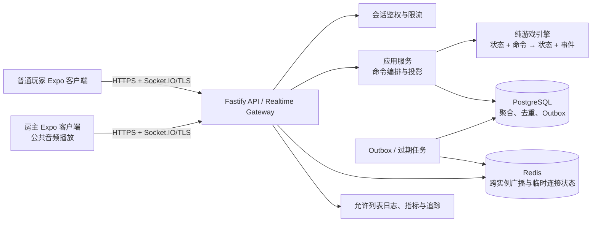
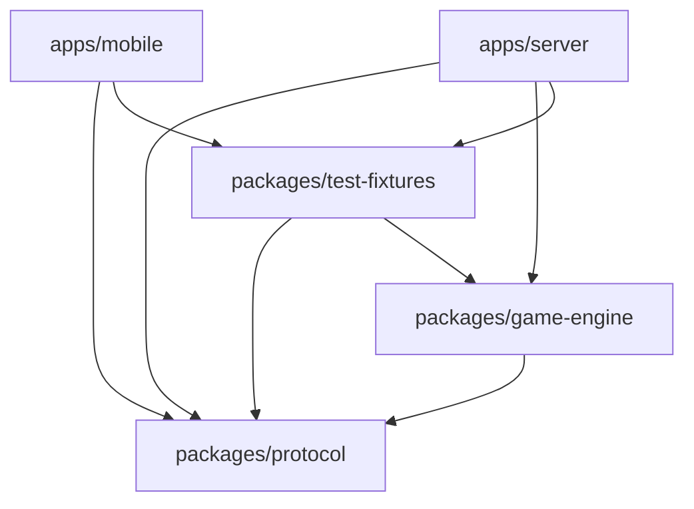
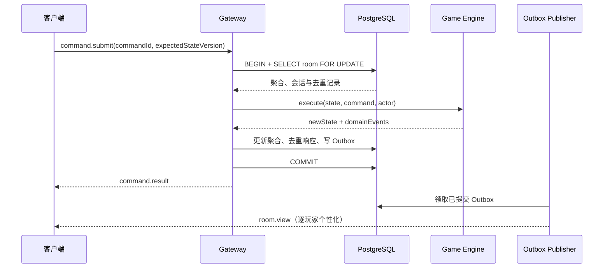

# Avalon MVP 技术架构总览

> 状态：P0 已接受基线
>
> 日期：2026-08-13
>
> 依赖：[规则](../game-rules.zh-CN.md) · [状态机](../server-state-machine.zh-CN.md) · [FR/NFR](../mobile-fr-nfr.zh-CN.md)

## 1. 架构目标

系统服务同一线下聚会中的 5–10 台移动设备。云端服务器必须以低延迟完成权威裁决，同时严格区分公开状态与每名玩家的秘密投影。架构优先级依次为：裁决正确性与保密、断线可恢复、可验证性、交付速度、水平扩展。

MVP 不采用端到端 P2P、本地房主服务器或客户端裁决。目标容量与可靠性来自 `NFR-001`–`NFR-007`，移动与安全约束来自 `NFR-009`–`NFR-024`。

## 2. 系统上下文

## 3. 组件职责

| 组件 | 职责 | 明确禁止 |
| --- | --- | --- |
| Expo 客户端 | 安全保存会话、提交意图、渲染个性化 `RoomView`、房主播放固定音频 | 本地计票、推断其他角色、离线推进、自动重放秘密动作 |
| HTTP API | 创建、加入、恢复、读取当前投影、健康检查 | 在 URL、日志或缓存键中放会话令牌 |
| Realtime Gateway | 认证连接、接收命令、确认结果、推送完整个性化投影 | 把内部领域事件或通用聚合直接广播 |
| 应用服务 | 授权、事务、幂等、调用引擎、构建投影、写 Outbox | 在事务外决定胜负或提交进度 |
| 游戏引擎 | 验证领域前置条件、状态转换、自动裁决、不变量 | 依赖 Fastify、Socket.IO、数据库、系统时间或 UI |
| PostgreSQL | 活跃聚合、会话摘要、幂等记录、Outbox、终局清除 | 保存明文 SessionToken、任务行动归属历史或已结束对局历史 |
| Redis | 多实例 Socket.IO adapter、连接/限流临时数据 | 成为唯一权威房间状态或唯一恢复来源 |
| 可观测性 | 记录无秘密的计数、延迟、错误码和诊断 ID | 记录角色、阵营、票值、任务选择、令牌或完整请求体 |

## 4. 代码布局与依赖方向

`game-engine` 可以引用协议中稳定的领域枚举，但不得引用传输信封、Socket.IO 类型或 HTTP 类型。若该依赖导致领域模型受传输影响，应把共享枚举下沉到 `packages/game-engine` 并由协议显式映射。

## 5. 核心数据流

### 5.1 命令事务

同一房间命令通过 PostgreSQL 房间行锁串行化；锁只覆盖短事务，绝不等待玩家输入。`expectedStateVersion` 提供用户可见的乐观并发错误，行锁提供多实例下的实际互斥。Outbox 保证“状态已提交”与“待广播”原子出现；客户端最终以最新完整投影收敛。

### 5.2 重连与恢复

1. 客户端从安全存储取得 `SessionToken`，调用恢复接口并完成令牌轮换；
2. 服务端返回最新 `RoomView`、实时地址和当前协议版本；
3. 客户端使用新令牌建立实时连接；
4. 首个 `session.ready` 始终带 `delivery=RESYNC`，因此音频不自动重播；
5. 后续版本连续的 `room.view` 使用 `delivery=LIVE`；版本缺口触发读取当前投影，不回放秘密动作。

Socket.IO 自带的临时连接恢复只能作为优化，不能替代上述应用级恢复和完整投影同步。

### 5.3 秘密投影

投影器接收权威聚合和目标 `PlayerId`，分别构建公开与本人私密部分。测试必须对每个角色和阶段使用字段允许列表。进入 `GAME_OVER` 后才能把全部角色加入公开投影；任务行动归属永不公开。

## 6. 决策记录

| ADR | 决定 | 状态 |
| --- | --- | --- |
| [ADR-001](./ADR-001-typescript-monorepo.md) | TypeScript + pnpm workspace 单仓库 | 已接受 |
| [ADR-002](./ADR-002-server-runtime-hosting.md) | Node.js/Fastify 长运行容器，供应商延后决定 | 已接受 |
| [ADR-003](./ADR-003-room-persistence-concurrency.md) | PostgreSQL 快照聚合 + 行锁 + Outbox，Redis 非权威 | 已接受 |
| [ADR-004](./ADR-004-realtime-protocol.md) | Socket.IO 命令确认 + 完整个性化投影 | 已接受 |
| [ADR-005](./ADR-005-expo-development-delivery.md) | Expo Router、CNG、Expo Go 到 Development Build/EAS | 已接受 |
| [ADR-006](./ADR-006-mobile-state-management.md) | TanStack Query 管远端投影，Zustand 仅管临时 UI | 已接受 |
| [ADR-007](./ADR-007-contract-source-of-truth.md) | JSON Schema 兼容的共享协议包为线上契约源 | 已接受 |
| [ADR-008](./ADR-008-m2-session-idempotency-and-delivery.md) | token 原子轮换、加密幂等响应与逐会话 Outbox 投递 | 已接受 |

## 7. 部署拓扑与演进

MVP 采用单区域部署：至少两个无状态应用实例、托管 PostgreSQL、托管 Redis 和一个可重复执行的后台任务实例。负载均衡器必须支持 TLS 和长连接。数据库与应用处于私网，只有入口层公开。

本地开发可以使用单应用实例、PostgreSQL 与 Redis 容器。Redis 不可用时，单实例开发可使用内存 adapter；任何共享测试或生产环境不得依赖单进程内存恢复。

供应商、区域、成本和数据驻留属于 M0 人工决策点。无论选择哪家供应商，都必须满足：长运行 WebSocket、事务型 PostgreSQL、Redis Streams 或等效广播、自动备份、健康检查、密钥管理和滚动回滚。

## 8. 架构质量门槛

| 属性 | 门槛 | 主要验证 |
| --- | --- | --- |
| 正确性 | 相同状态与命令产生相同裁决；无客户端裁决 | 引擎表驱动/性质测试、契约测试 |
| 保密 | 游戏结束前无跨玩家角色或任务行动泄漏 | 投影矩阵、日志扫描、代理越权测试 |
| 幂等 | 重复或并发命令最多产生一次规则效果 | 数据库集成测试、故障注入 |
| 恢复 | 已确认命令 RPO 0；重连获得最新投影 | 崩溃点、网络切换、令牌轮换测试 |
| 性能 | 满足 `NFR-002`–`NFR-004` | 分层延迟指标和 30 分钟负载测试 |
| 可维护 | 领域层无 I/O；协议只有一个生成源 | 依赖边界测试、Schema 快照检查 |

## 9. 外部依据

- Expo 对 pnpm workspaces 和自动 monorepo Metro 配置的说明：[Work with monorepos](https://docs.expo.dev/guides/monorepos/)；
- Expo Router 与 `create-expo-app` 的推荐初始化方式：[Expo Router introduction](https://docs.expo.dev/router/introduction/)；
- Socket.IO 默认消息到达为至多一次，额外保证需由应用实现：[Delivery guarantees](https://socket.io/docs/v4/delivery-guarantees/)；
- Socket.IO 连接恢复仍要求应用处理无法恢复并重新同步的情况：[Connection state recovery](https://socket.io/docs/v4/connection-state-recovery/)；
- PostgreSQL `SELECT ... FOR UPDATE` 的行级互斥语义：[Explicit locking](https://www.postgresql.org/docs/current/explicit-locking.html)。
