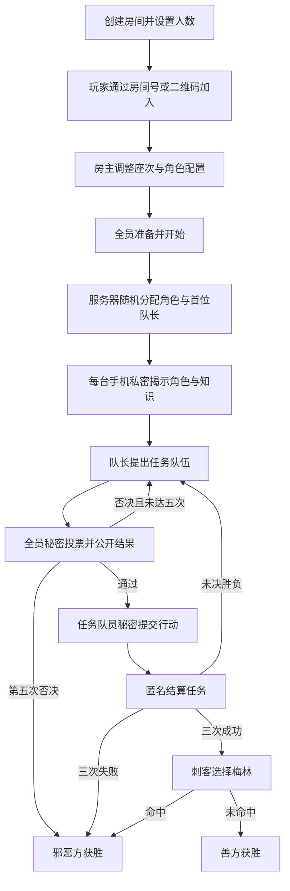

# 阿瓦隆移动端游戏规则规范

> 文档状态：MVP 规范基线
>
> 目标读者：玩家、产品经理、设计师、客户端与服务端工程师、测试工程师
>
> 规范语言：本文中的“必须”“不得”“应”属于规范性要求；“建议”不影响合法性与胜负裁决。

## 1. 文档目的与规则来源

本文同时完成两件事：

1. 总结 [avalon-game.com 规则页](https://avalon-game.com/wiki/rules/) 所描述的玩法；
2. 给出本移动端产品唯一具有裁决效力的 MVP 规则，供状态机和客户端共同实现。

核心冲突以经典版《The Resistance: Avalon》[英文规则手册](https://cdn.1j1ju.com/medias/a6/dc/c1-the-resistance-avalon-rulebook.pdf)为准。产品规则版本标识为 `CLASSIC_AVALON_V1`。如果来源摘要与“产品规范规则”冲突，必须以后者为准。

## 2. 原网页规则摘要

### 2.1 游戏目标

- 玩家秘密分为亚瑟阵营（善方）和莫德雷德阵营（邪恶方）。
- 善方需要在最多五次任务中成功三次。
- 邪恶方需要令三次任务失败；若善方先完成三次任务，邪恶方仍可通过识别并刺杀梅林翻盘。
- 讨论、推理、欺骗、组队和投票是主要互动方式，玩家可以在不展示身份凭证的前提下作出任意口头声明。

### 2.2 基本回合

1. 当前队长按本轮人数要求提出任务队伍。
2. 全体玩家秘密投票同意或否决队伍，随后同时公开投票。
3. 队伍获批后，队员秘密提交任务“成功”或“失败”。
4. 提交结果匿名混合后公开，并据此结算任务。
5. 队长顺时针轮换，继续下一轮组队或下一次任务。

### 2.3 人数、角色与扩展

原网页覆盖 5–10 人，介绍梅林、派西维尔、莫甘娜、莫德雷德、奥伯伦、普通忠臣和普通邪恶角色，并推荐逐步加入湖中仙女、崔斯坦与伊索尔德、王者之剑等扩展。网页还建议将刺杀权交给某一邪恶角色或由邪恶阵营集体决定。

这些内容会影响产品取舍，但不全部进入 MVP。第 11 节列出来源与产品规则的差异。

## 3. 术语

| 术语 | 英文/标识 | 定义 |
| --- | --- | --- |
| 房主 | Host | 创建房间并参与游戏的玩家；拥有配置、开始、节奏控制和语音重播权限。 |
| 玩家 | Player | 占据一个固定座次并获得一个秘密角色的参赛者，房主也是玩家。 |
| 善方 | Good | 亚瑟阵营，包括梅林、派西维尔和忠臣。 |
| 邪恶方 | Evil | 莫德雷德阵营，包括刺客、莫甘娜、莫德雷德、奥伯伦和爪牙。 |
| 任务 | Quest | 一局最多进行五次的阵营对抗单元。 |
| 任务队伍 | Quest Team | 当前队长提名、经全体玩家表决后执行任务的玩家集合。 |
| 组队尝试 | Proposal Attempt | 同一次任务中，从队长提名到全体表决的一次完整尝试。 |
| 队长 | Leader | 当前负责提出任务队伍的玩家。 |
| 组队票 | Team Vote | 全体玩家对当前任务队伍提交的“同意”或“否决”。 |
| 任务行动 | Quest Choice | 任务队员提交的“成功”或“失败”。 |
| 私密知识 | Private Knowledge | 只有指定玩家可以在自己手机上看到的角色或阵营信息。 |
| 公开状态 | Public State | 所有玩家均可看到且内容相同的对局信息。 |

## 4. 产品规范规则

### 4.1 对局范围与胜负目标

**RULE-001 — 人数与阵营。** 每局必须恰好有 5–10 名玩家。每名玩家必须且只能属于善方或邪恶方，阵营数量必须符合第 5.1 节。

**RULE-002 — 善方目标。** 善方必须先完成三次成功任务，并在随后的刺杀阶段保护梅林，才最终获胜。

**RULE-003 — 邪恶方目标。** 满足下列任一条件时邪恶方获胜：

- 三次任务失败；
- 同一次任务的五次组队尝试均被否决；
- 善方取得三次任务成功后，刺客正确选中梅林。

### 4.2 房间、座次与开局

**RULE-004 — 房间配置。** 房主必须在开局前确定目标人数和合法角色配置。玩家达到目标人数、全部准备且配置合法后才可开始；开局后不得更改人数、座次或角色配置。

**RULE-005 — 座次与队长。** 座次默认按加入顺序生成，房主可在开局前调整。系统在开局时从全部座次中等概率随机选择首位队长；此后队长按固定座次顺序循环轮换。

**RULE-006 — 秘密分配。** 服务器必须随机分配角色，并仅向对应玩家手机下发该角色及其可知信息。手机私密揭示取代传统闭眼、睁眼和手势流程。所有玩家确认已查看身份后，才可进入第一次组队。

**RULE-007 — 身份保密。** 游戏结束前，系统不得公开任何玩家的具体角色或阵营。玩家可以口头声称自己是任意角色，但不得通过应用展示、转发或验证自己的私密角色页面。

### 4.3 组队与投票

**RULE-008 — 提出队伍。** 当前队长必须提出人数恰好符合第 5.2 节的任务队伍。队长可以选择自己，也可以不选择自己；同一玩家在同一队伍中不得重复出现。

**RULE-009 — 全员秘密投票。** 包括队长在内的所有玩家必须各自秘密提交一次“同意”或“否决”。全部玩家提交前，不得公开任何人的投票内容，也不得公开哪些具体玩家已经提交。

**RULE-010 — 投票公开与判定。** 全部投票提交后，系统必须同时公开每名玩家的组队票。只有同意票严格多于玩家总数的一半时队伍才获批；平票视为否决。

**RULE-011 — 否决与五次否决。** 队伍被否决后，队长轮换到下一座次，并在同一次任务内开始新的组队尝试。若该任务的第五次组队尝试仍被否决，游戏立即结束，邪恶方获胜。

### 4.4 任务提交与结算

**RULE-012 — 任务行动权限。** 只有获批任务队伍的成员可以提交任务行动。善方角色必须提交“成功”；邪恶角色可以提交“成功”或“失败”。每名队员只能提交一次有效行动。

**RULE-013 — 匿名结算。** 全部队员提交后，系统必须匿名汇总并公开成功票数、失败票数和任务结果，不得公开单个行动与玩家的对应关系。

**RULE-014 — 失败阈值。** 通常出现至少一张失败票即任务失败；唯一例外是 7–10 人游戏的第四次任务，该任务需要至少两张失败票才失败。低于失败阈值时任务成功。

**RULE-015 — 任务推进。** 任务结算后更新成功与失败次数。若尚未触发胜负条件，则任务序号加一、组队尝试重置为第一次，队长从执行该任务的队长处继续轮换到下一座次。

### 4.5 游戏结束与刺杀

**RULE-016 — 三次失败。** 任意任务结算令失败任务累计达到三次时，游戏立即结束，邪恶方获胜，不进入刺杀。

**RULE-017 — 三次成功。** 任意任务结算令成功任务累计达到三次时，停止后续任务并进入刺杀阶段；此时不得公开角色。

**RULE-018 — 刺客选择。** 刺客在邪恶方完成线下公开讨论后选择一名玩家作为梅林。应用不得按真实阵营过滤候选人，因为这会泄漏奥伯伦等角色；除刺客本人外的存活玩家均可被选择。

**RULE-019 — 最终裁决。** 刺客选中梅林时邪恶方获胜，否则善方获胜。裁决完成后，系统公开全部玩家的角色、最终比分和胜因。

### 4.6 线下讨论与主持

**RULE-020 — 讨论渠道。** MVP 不提供远程文字或语音聊天。玩家使用线下自然对话进行讨论，服务器只裁决数字化动作。

**RULE-021 — 半自动节奏。** 房主可以暂停、继续阶段或重播当前语音提示；一旦某阶段所需的合法提交全部到齐，服务器必须自动、确定性地完成结算。

**RULE-022 — 断线公平性。** 角色分配后不得替换或踢出玩家。任何必要玩家断线时对局暂停；重连后从原状态继续，不重新分配角色、不清除已接受的提交，也不转移房主权。

## 5. 人数与任务配置表

### 5.1 善恶阵营人数

| 玩家数 | 善方 | 邪恶方 |
| ---: | ---: | ---: |
| 5 | 3 | 2 |
| 6 | 4 | 2 |
| 7 | 4 | 3 |
| 8 | 5 | 3 |
| 9 | 6 | 3 |
| 10 | 6 | 4 |

该表属于 `RULE-001` 的规范性组成部分。

### 5.2 每次任务队伍人数

| 玩家数 | 任务 1 | 任务 2 | 任务 3 | 任务 4 | 任务 5 |
| ---: | ---: | ---: | ---: | ---: | ---: |
| 5 | 2 | 3 | 2 | 3 | 3 |
| 6 | 2 | 3 | 4 | 3 | 4 |
| 7 | 2 | 3 | 3 | 4* | 4 |
| 8 | 3 | 4 | 4 | 5* | 5 |
| 9 | 3 | 4 | 4 | 5* | 5 |
| 10 | 3 | 4 | 4 | 5* | 5 |

`*` 表示至少两张失败票才会令任务失败；其他任务至少一张失败票即失败。该表属于 `RULE-008` 和 `RULE-014` 的规范性组成部分。

## 6. MVP 角色

| 角色 | 阵营 | 必选 | 能力 |
| --- | --- | --- | --- |
| 梅林 `MERLIN` | 善方 | 是 | 开局知道除莫德雷德外的所有邪恶玩家，但必须避免被刺杀。 |
| 忠臣 `LOYAL_SERVANT` | 善方 | 否 | 无开局额外信息。 |
| 派西维尔 `PERCIVAL` | 善方 | 否 | 看到梅林候选人；莫甘娜在场时无法区分二者。 |
| 刺客 `ASSASSIN` | 邪恶方 | 是 | 参与邪恶方开局互认，并在三次任务成功后选择刺杀目标。 |
| 爪牙 `MINION` | 邪恶方 | 否 | 参与邪恶方开局互认。 |
| 莫甘娜 `MORGANA` | 邪恶方 | 否 | 参与邪恶方互认，并在派西维尔视角中伪装为梅林候选人。 |
| 莫德雷德 `MORDRED` | 邪恶方 | 否 | 参与邪恶方互认，但不会被梅林看到。 |
| 奥伯伦 `OBERON` | 邪恶方 | 否 | 不知道其他邪恶玩家，其他邪恶玩家也不知道其身份；梅林仍能看到奥伯伦。 |

## 7. 私密知识矩阵

“看到”表示手机显示玩家身份或候选信息；没有列出的信息一律不得下发。

| 查看者 | 可以看到的开局信息 |
| --- | --- |
| 梅林 | 所有邪恶玩家的位置，但排除莫德雷德；包括奥伯伦。仅显示为“邪恶玩家”，不显示具体邪恶角色。 |
| 派西维尔 | 梅林；若莫甘娜在场，同时看到梅林与莫甘娜，但两者均显示为不可区分的“梅林候选人”。 |
| 刺客、爪牙、莫甘娜、莫德雷德 | 彼此知道同阵营玩家，但名单排除奥伯伦；可显示为“已知邪恶同伴”，无需显示具体角色。 |
| 奥伯伦 | 不获得任何同阵营信息。 |
| 忠臣 | 不获得任何额外信息。 |

知识计算必须由服务器根据角色集合生成，客户端不得从完整角色表自行过滤。

## 8. 角色配置与校验

### 8.1 经典预设

- 善方：一名梅林，其余为忠臣。
- 邪恶方：一名刺客，其余为爪牙。

这是所有人数的默认配置。

### 8.2 常用角色预设

- 善方：梅林、派西维尔，其余为忠臣。
- 邪恶方：刺客、莫甘娜，其余为爪牙。

该预设适用于 5–10 人，并保持第 5.1 节的阵营数量。

### 8.3 自定义配置硬校验

自定义配置必须同时满足：

1. 角色总数等于房间目标人数；
2. 善恶角色数等于第 5.1 节；
3. 恰好一名梅林和一名刺客；
4. 派西维尔、莫甘娜、莫德雷德、奥伯伦各至多一名；
5. 莫甘娜在场时派西维尔必须在场；
6. 5 人游戏包含派西维尔时，邪恶方必须至少包含莫甘娜或莫德雷德之一；
7. 所有剩余名额只能由对应阵营的忠臣或爪牙填充。

不满足硬校验的配置不得保存、分享或开始游戏。

## 9. 数字化对局流程

## 10. 信息公开规则

| 时点 | 所有人可见 | 仅本人可见 |
| --- | --- | --- |
| 大厅 | 昵称、座次、房主、准备状态、公开角色配置 | 会话恢复凭证 |
| 角色揭示 | 已确认人数、确认进度总数 | 自己的角色、阵营、角色说明、私密知识 |
| 组队 | 当前队长、任务序号、尝试次数、队伍人数要求、所选队伍 | 无额外内容 |
| 组队投票中 | 已提交数量，不显示提交者 | 自己已提交但不回显可更改入口 |
| 组队投票后 | 每名玩家的同意/否决及总票数 | 无额外内容 |
| 任务提交中 | 已提交数量，不显示提交者和选项 | 自己可用的合法选项与提交状态 |
| 任务结算后 | 成功票数、失败票数、任务结果、累计比分 | 不公开行动归属 |
| 刺杀 | 已进入刺杀、刺客正在选择 | 刺客看到选择控件；其他玩家只能等待 |
| 游戏结束 | 胜方、胜因、全部角色、五轮记录 | 无额外内容 |

## 11. 来源差异与非 MVP 变体

| 主题 | 原网页描述 | 本产品 MVP |
| --- | --- | --- |
| 连续否决 | 前四次否决后，第五位队长可不经投票直接组队。 | 同一次任务五次组队均被否决，邪恶方立即获胜。 |
| 刺杀权 | 可交给任一邪恶角色或由邪恶方共同决定。 | 必须存在独立刺客，由刺客提交最终目标。 |
| 推荐配置 | 多数推荐配置使用莫德雷德与莫甘娜，未单列刺客。 | 梅林和刺客必选，其他常用角色替换同阵营普通角色。 |
| 湖中仙女 | 7 人以上可用，任务二后开始检查阵营并转移持有者。 | 非 MVP；仅保留未来扩展状态接口。 |
| 王者之剑 | 队长分配给任务队员，可修改一次任务行动。 | 非 MVP。 |
| 崔斯坦与伊索尔德 | 推荐用于部分高人数配置。 | 非 MVP。 |
| 传统夜晚流程 | 通过闭眼、睁眼和手势交换信息。 | 由服务器向各手机下发私密知识。 |

## 12. 规则不变量

实现与测试必须始终保证：

- 任意时刻每名玩家恰好占据一个座次并拥有一个角色；
- 游戏中角色与阵营数量不会变化；
- 当前队伍人数始终等于任务配置表要求；
- 每名玩家每次组队投票最多有一个有效提交；
- 每名任务队员每次任务最多有一个有效提交；
- 任务行动公开结果无法反推出玩家与行动的映射；
- 成功任务数和失败任务数之和等于已结算任务数，且均不超过三次；
- `GAME_OVER` 为终态，不再接受改变胜负或角色的命令。
