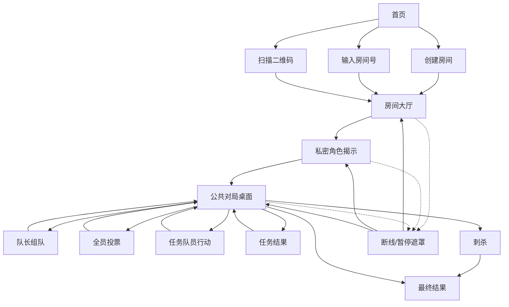

# 阿瓦隆移动端应用功能与非功能需求

> 文档状态：可上线 MVP 需求基线
>
> 目标平台：iOS、Android
>
> 依赖文档：[游戏规则规范](./game-rules.zh-CN.md) · [服务端状态机规范](./server-state-machine.zh-CN.md)
>
> 产品场景：同一线下聚会中的每名参赛者使用一台手机，云端服务器统一裁决，房主手机承担公共语音主持。

## 1. 产品目标

应用必须在不使用实体身份牌、投票牌、任务牌或主持人的情况下，让 5–10 名同处一地的玩家完成一局经典阿瓦隆。系统负责秘密分配与呈现、组队投票、匿名任务结算、刺杀和胜负裁决；玩家继续在线下进行自由讨论。

MVP 的成功标准：

- 新玩家能够通过房间号或二维码在两分钟内完成组局；
- 所有规则相关操作都由服务端验证，客户端无法通过篡改请求改变身份权限或结算；
- 除规则允许的信息外，任何玩家都无法从界面、事件或日志获得其他人的秘密；
- 网络短暂中断不会导致重新发牌、重复计票、重复语音或不可恢复的对局丢失；
- 固定中文语音和同步字幕可以引导玩家完成整局。

## 2. 范围与角色

### 2.1 用户角色

| 用户角色 | 说明 | 关键权限 |
| --- | --- | --- |
| 房主玩家 | 创建房间且计入目标人数，可能获得任意游戏角色。 | 配置人数/角色、调整座次、移除大厅玩家、开始、阶段继续、手动暂停/恢复、语音重播、关闭房间。 |
| 普通玩家 | 通过房间号或二维码加入并获得固定座次。 | 准备、查看自己的角色知识、按当前身份与阶段提交动作、重连。 |
| 当前队长 | 由服务端按座次轮换的临时游戏职责。 | 在 `TEAM_PROPOSAL` 提交任务队伍。 |
| 刺客 | 由秘密角色决定的临时游戏职责。 | 在 `ASSASSINATION` 选择刺杀目标。 |

### 2.2 MVP 包含

- 5–10 人云端权威房间；
- 游客昵称、房间号、二维码和设备会话恢复；
- 经典预设、常用角色预设和经过校验的自定义角色；
- 梅林、忠臣、派西维尔、刺客、爪牙、莫甘娜、莫德雷德、奥伯伦；
- 固定中文公共语音、逐字字幕和半自动主持；
- 短暂断线暂停、原会话恢复和完整结果页。

### 2.3 MVP 不包含

- 注册登录、社交账号、好友、匹配、观战和远程房间；
- 应用内文字聊天、远程语音聊天或录音；
- 历史战绩、排行榜、成就、付费、广告；
- 举报治理、运营后台、用户生成内容审核；
- 湖中仙女、王者之剑、崔斯坦、伊索尔德及其他扩展；
- 多语言语音包、完全离线或房主手机作为本地服务器；
- 中途替补、机器人玩家或房主控制权迁移。

## 3. 页面与导航

| 页面/组件 | 所有人 | 房主差异 | 私密差异 |
| --- | --- | --- | --- |
| 首页 | 创建、输入房间号、扫描二维码、昵称入口 | 无 | 本地已有有效会话时显示“恢复对局”。 |
| 创建房间 | 人数、角色预设、昵称 | 创建后成为房主 | 无 |
| 房间大厅 | 房间号、二维码、玩家、座次、准备、配置摘要 | 编辑配置、拖动座次、移除玩家、音频预检、开始 | 会话状态仅本人可见 |
| 角色揭示 | 确认进度总数 | 阶段继续、语音控制 | 本人角色、说明和私密知识 |
| 公共对局桌面 | 任务轨道、比分、尝试次数、当前队长、连接和暂停状态 | 阶段继续、暂停、语音控制 | 本人当前可执行动作入口 |
| 投票/任务弹层 | 进度总数；结算后显示规则允许的公开结果 | 无 | 本人的合法选项和提交确认 |
| 刺杀页 | 等待刺客、固定说明 | 主持控制 | 只有刺客可选目标 |
| 最终结果 | 胜方、胜因、全部角色、任务历史 | 关闭房间 | 无 |

## 4. 功能需求（FR）

### 4.1 游客身份、建房与加入

| ID | 需求 | 验收标准 | 追踪 |
| --- | --- | --- | --- |
| `FR-001` | 用户无需注册即可输入游客昵称。昵称去除首尾空白后为 1–16 个可见 Unicode 字符，不得包含控制字符或可执行标记。 | 合法昵称可继续；空白、过长或非法昵称显示字段级错误且不发送建房/加入请求。 | `SM-001`、`SM-002` |
| `FR-002` | 创建页必须让房主选择 5–10 人、经典/常用角色预设或自定义配置；默认选择经典预设。 | 创建成功后房主占据第一个座次，看到 6 位房间号与二维码。 | `RULE-001`、`RULE-004`、`SM-001` |
| `FR-003` | 大厅必须持续展示可复制、可口头读出的房间号，并可打开全屏二维码。 | 复制结果只含房间号；二维码只含公开加入链接，不含玩家、会话或角色秘密。 | `NFR-013`、`SM-002` |
| `FR-004` | 玩家可以手动输入房间号或授权摄像头扫描二维码加入。 | 房间号大小写不敏感；摄像头被拒绝时仍可手动输入，不阻塞加入。 | `SM-002` |
| `FR-005` | 无效、过期、已满或已开局的房间必须显示不同的可恢复错误。 | 错误页不暴露房间是否存在之外的玩家或配置秘密；提供重新输入和返回首页。 | `ErrorCode` |
| `FR-006` | 创建或加入成功后，应用必须把会话令牌保存到平台安全存储。 | 进程重启后可显示“恢复对局”；令牌不写入普通偏好、剪贴板、URL 或日志。 | `SM-003`、`NFR-010` |
| `FR-007` | 普通玩家可在开局前主动退出，房主可移除普通玩家。 | 操作完成后座次重新连续编号，全员准备状态被重置；开局后不显示这些入口。 | `SM-017`、`SM-018` |
| `FR-008` | 房主可在大厅关闭房间；活跃对局中不提供主动关闭入口。 | 大厅关闭后所有连接返回首页。游戏结束由服务端完成终局投递并自动清除房间，结果页的“返回首页”只清理本机内存。 | `SM-019`、`NFR-016` |

### 4.2 大厅、座次和角色配置

| ID | 需求 | 验收标准 | 追踪 |
| --- | --- | --- | --- |
| `FR-009` | 大厅按固定座次显示昵称、房主、在线和准备状态。 | 所有设备顺序一致；加入时默认追加到末尾。 | `RULE-005` |
| `FR-010` | 房主可在开始前拖动玩家调整座次。 | 保存必须一次提交完整玩家顺序；成功后所有设备同步且全员准备重置。 | `RULE-005`、`SM-005` |
| `FR-011` | 房主可切换经典、常用角色预设或逐个选择自定义角色。 | 界面始终显示善恶数量、已选角色数与目标人数。 | 规则文档第 8 节、`SM-004` |
| `FR-012` | 自定义角色必须即时显示全部硬校验错误。 | 阵营数量、梅林/刺客必选、唯一性、莫甘娜依赖及 5 人派西维尔约束均通过后才可保存。 | `RULE-001`、`RULE-004` |
| `FR-013` | 任意配置或座次变化必须将所有玩家恢复为未准备。 | 变更后开始按钮立即不可用，各玩家需再次确认。 | `SM-004`、`SM-005` |
| `FR-014` | 每名玩家可切换自己的准备状态。 | 其他设备只看到准备结果，不获得设备或会话信息。 | `SM-006` |
| `FR-015` | 开始按钮只对房主显示，且仅在人数已满、全员在线准备、配置合法时启用。 | 服务端拒绝条件与禁用提示一致；重复点击不会开始两局或重复发牌。 | `RULE-004`、`SM-007` |
| `FR-016` | 大厅必须提供“测试主持语音”。 | 播放固定测试片段和字幕，不改变房间状态；失败时提示检查媒体音量并允许仅字幕继续。 | `NFR-015` |

### 4.3 私密角色揭示

| ID | 需求 | 验收标准 | 追踪 |
| --- | --- | --- | --- |
| `FR-017` | 开局后每台设备只展示本人的角色、阵营、能力说明和私密知识。 | 不同角色的快照符合规则文档第 7 节；抓取公开事件无法复原其他角色。 | `RULE-006`、`RULE-007`、`SM-007` |
| `FR-018` | 私密知识必须以语义标签呈现，不泄漏超额信息。 | 梅林只看到邪恶标签且排除莫德雷德；派西维尔看到不可区分的候选人；邪恶互认排除奥伯伦。 | 规则文档第 7 节 |
| `FR-019` | 玩家必须主动确认“我已记住身份”。 | 确认只能成功一次；公开界面只显示确认人数，不显示具体未确认者。 | `SM-009` |
| `FR-020` | 角色页必须降低旁观和系统预览泄漏风险。 | 进入后台时应用切换器使用模糊占位；回到前台需重新进行设备级解锁或显式点按查看；不得自动朗读私密角色。 | `NFR-014` |

### 4.4 组队、投票和任务

| ID | 需求 | 验收标准 | 追踪 |
| --- | --- | --- | --- |
| `FR-021` | 公共对局桌面持续显示任务序号、五轮结果、成功/失败计数、当前队长、组队尝试和本轮所需人数。 | 所有值来自公开快照，不能由客户端自行推进。 | `RULE-005`、`RULE-015` |
| `FR-022` | 每个新交互阶段先显示主持提示，由房主点击“继续”后开放操作。 | `HOST_HELD` 时其他玩家只能查看和讨论；继续成功后操作入口同步启用。 | `RULE-021`、`SM-008` |
| `FR-023` | 当前队长可按座次选择任务队伍。 | 达到规定人数前提交按钮禁用；成员不重复；可选或不选自己；服务端仍进行最终校验。 | `RULE-008`、`SM-010` |
| `FR-024` | 全体玩家在投票阶段各自选择同意或否决并二次确认提交。 | 提交后不能修改；结算前只显示总提交数，不显示提交者与票值。 | `RULE-009`、`SM-011` |
| `FR-025` | 全员提交后同时展示每名玩家的组队票、同意/否决总数和是否通过。 | 平票显示“否决”；结果在所有设备一致且不可被客户端重算覆盖。 | `RULE-010`、`SM-011` |
| `FR-026` | 队伍被否决时显示尝试轨道和下一位队长。 | 第 1–4 次否决后继续组队；第 5 次否决锁定邪恶方胜利。 | `RULE-011` |
| `FR-027` | 获批队伍成员进入任务行动页，非队员进入等待页。 | 善方只看到“成功”；邪恶方看到“成功”和“失败”；非队员无法构造合法提交。 | `RULE-012`、`SM-012` |
| `FR-028` | 任务行动提交必须二次确认并在提交后隐藏具体选择。 | 等待页只显示本人已提交；公开页面只显示总提交数，不显示提交者。 | `RULE-012`、`RULE-013` |
| `FR-029` | 全部队员提交后显示匿名成功票数、失败票数、本次任务结果和累计比分。 | 不显示票与玩家映射；7–10 人第四次任务使用两张失败票阈值。 | `RULE-013`、`RULE-014` |
| `FR-030` | 任务结果页由房主继续到下一任务、刺杀或最终结果。 | 继续按钮只改变展示阶段，不得改变已经锁定的任务结果或胜负。 | `RULE-015`–`RULE-017`、`SM-008` |
| `FR-031` | 公开任务历史必须显示每次任务的队长、获批队伍、组队公开票、匿名任务票数和结果。 | 历史永不显示任务行动归属，也不展示被否决队伍之外的私密内容。 | `RULE-013` |

### 4.5 刺杀与最终结果

| ID | 需求 | 验收标准 | 追踪 |
| --- | --- | --- | --- |
| `FR-032` | 三次任务成功后进入刺杀等待页，不提前公开任何角色。 | 全体可线下讨论；只有刺客在房主继续后获得选择控件。 | `RULE-017`、`SM-013` |
| `FR-033` | 刺客可从除自己外的全部玩家中选择并二次确认目标。 | 候选列表不得按真实阵营过滤；提交后立即锁定且不可修改。 | `RULE-018`、`SM-013` |
| `FR-034` | 最终结果页展示胜方、胜因、刺杀目标、全部角色、任务比分和公开历史。 | 三次失败、五次否决、刺杀命中、刺杀未命中四种胜因文案不同；`ABORTED` 不显示阵营胜方。结果只保存在当前客户端内存，不提供历史查询或终局后的恢复。 | `RULE-019`、`GameOutcome`、`NFR-016` |

### 4.6 语音主持与字幕

| ID | 需求 | 验收标准 | 追踪 |
| --- | --- | --- | --- |
| `FR-035` | 只有房主设备播放公共主持语音，所有设备显示同步字幕。 | 同一 `audioCueId` 在房主设备最多自动播放一次；普通玩家设备从不自动播放公共语音。 | `AudioCue` |
| `FR-036` | MVP 只使用随应用发布的固定中文音频，不使用运行时 TTS。 | 动态昵称、队伍成员和票数仅显示在屏幕；音频包缺失时自动降级为字幕。 | `RULE-021`、`NFR-015` |
| `FR-037` | 房主可调整应用内主持音量、静音和重播当前提示。 | 重播创建新的提示实例；静音不隐藏字幕；设置在本设备持久化。 | `SM-016` |
| `FR-038` | 电话、闹钟或其他音频打断主持时必须保留字幕和重播入口。 | 返回应用后不自动从头重复播放；房主明确点击重播才重新播放。 | `NFR-021` |
| `FR-039` | 语音与字幕资源必须按同一版本成对加载。 | 版本或校验失败时不播放错误音频，显示字幕并上报不含游戏秘密的错误。 | `NFR-015`、`NFR-019` |

### 4.7 暂停、断线、恢复和错误

| ID | 需求 | 验收标准 | 追踪 |
| --- | --- | --- | --- |
| `FR-040` | 房主可手动暂停活跃对局并输入可选公开原因。 | 暂停遮罩覆盖动作入口但保留公共状态；只有房主可解除手动暂停。 | `RULE-022`、`SM-014`、`SM-015` |
| `FR-041` | 任一必要玩家连续断线达到 10 秒时，全体进入连接暂停。 | 遮罩显示离线玩家和保留倒计时；已提交动作不丢失，未提交入口禁用。 | `RULE-022`、`SM-020` |
| `FR-042` | 应用启动、回前台或实时连接恢复后必须优先尝试恢复已有会话。 | 令牌有效时返回最新公开快照和本人私密投影；客户端丢弃本地未确认的过期状态。 | `SM-003` |
| `FR-043` | 所有断线玩家恢复后，连接暂停自动解除；房主断线不转移控制权。 | 回到中断前同一阶段与阶段门；不重发角色、不重置提交、不自动重播语音。 | `RULE-022` |
| `FR-044` | 活跃对局连续暂停状态最多保留 60 分钟。 | 倒计时内可恢复；到达硬上限后中止且不判定阵营胜负。大厅房主离线过期仍为 30 分钟。 | `SM-021`、`NFR-006` |
| `FR-045` | 角色分配后不得显示退出、移除或替补功能。 | 用户主动关闭应用等同断线；其他玩家只能等待其恢复或房间过期。 | `RULE-022` |
| `FR-046` | `STALE_VERSION`、重复提交和阶段已推进不得造成重复动作。 | 客户端刷新投影并显示非破坏性提示；不得未经用户再次确认自动重放不同动作。 | `SM-011`、`SM-012`、`NFR-007` |
| `FR-047` | 所有服务端错误必须映射为可本地化、可行动的界面状态。 | UI 不显示堆栈、内部 ID、角色表或原始请求；未知错误提供重试和复制匿名诊断码。 | `ErrorCode` |
| `FR-048` | 连续暂停满 60 秒后，任一在线玩家可发起 30 秒终止投票。 | 选民固定为发起时在线玩家；界面公开总选民数、提交数和截止倒计时，只向本人显示投票资格/已提交状态，不公开个人选择。 | `RULE-023`、`SM-022`、`SM-023` |
| `FR-049` | 只有严格超过半数在线选民选择继续暂停时才保留对局。 | 继续多数形成后重新冷却 60 秒；全员完成或截止时未形成多数则以 `ABORTED` 终止、清除本机会话并返回首页。 | `RULE-023`、`SM-023` |

## 5. 非功能需求（NFR）

### 5.1 可用性、性能与容量

| ID | 要求 | 验证方式 |
| --- | --- | --- |
| `NFR-001` | 云端房间与实时裁决月可用性不低于 99.5%，不含提前 72 小时公告的计划维护。 | 服务端 SLI 按成功创建/加入、实时连接与命令处理可用分钟计算。 |
| `NFR-002` | 在服务端无排队且典型 Wi‑Fi/4G 条件下，创建和加入请求 p95 端到端不超过 2 秒。 | 生产合成探针与发布前移动网络测试。 |
| `NFR-003` | 已建立实时连接时，合法命令从服务端接收到确认并向同房间广播结果的 p95 不超过 1 秒。 | 按命令类型记录不含载荷的直方图。 |
| `NFR-004` | 基线压测必须支持至少 1,000 个并发房间和 10,000 条并发实时连接；单房间上限固定为 10 名玩家。 | 持续 30 分钟混合阶段负载，无秘密泄漏、重复结算或超过 1% 错误率。 |
| `NFR-005` | 心跳策略必须在连续失联后 10 秒内把活跃房间置为暂停，同时容忍短时网络抖动。 | 网络代理注入丢包、切网和后台恢复测试。 |
| `NFR-006` | 活跃对局连续暂停的硬上限为 60 分钟；暂停、投票选民/选择与截止时间在房间进程重启后应于 5 秒内从持久状态恢复。 | 故障注入、可控时钟和数据恢复演练。 |
| `NFR-007` | 服务端确认成功的命令恢复点目标为 RPO 0；重复、乱序或并发请求不得重复产生规则效果。 | 命令去重、版本冲突和进程崩溃测试。 |
| `NFR-008` | 移动端无崩溃会话比例发布后应不低于 99.5%。 | 崩溃平台按版本与系统统计，禁止附带角色/任务选择。 |

### 5.2 兼容性与设备能力

| ID | 要求 | 验证方式 |
| --- | --- | --- |
| `NFR-009` | 发布时支持 iOS 和 Android 当前主要版本及前两个主要版本，覆盖手机竖屏；平板至少可用但不要求专属布局。 | 发布矩阵的真机/云真机回归。 |
| `NFR-010` | `SessionToken` 必须存储于 iOS Keychain 或 Android Keystore 支持的安全存储，恢复成功后轮换。 | 静态检查、越狱/Root 风险说明和令牌轮换集成测试。 |
| `NFR-011` | 摄像头仅用于主动扫码；拒绝权限不会影响房间号加入。麦克风权限不得申请。 | 权限矩阵与商店隐私清单检查。 |

### 5.3 安全与隐私

| ID | 要求 | 验证方式 |
| --- | --- | --- |
| `NFR-012` | 所有网络流量使用 TLS 1.2 或以上；实时连接与请求接口使用同等身份验证和授权。 | 自动配置扫描、抓包和降级攻击测试。 |
| `NFR-013` | 房间号具有 30 位随机熵；加入失败按 IP 与应用本地随机安装标识组合限制为每分钟 5 次，该标识不得使用硬件或广告标识符。限流键使用服务端 HMAC 摘要，原始 IP/安装标识不得进入应用日志，计数键 TTL 不超过 10 分钟。二维码仅含公开加入链接。 | 随机性测试、限流测试、Redis TTL/日志检查、二维码解码检查。 |
| `NFR-014` | 服务端只能向连接发送其 `PublicSnapshot + PrivatePlayerProjection`；角色、私密知识、未公开票和任务行动不得进入通用日志、崩溃报告或分析事件。 | 角色矩阵契约测试、日志扫描和代理连接越权测试。 |
| `NFR-015` | 固定音频包与字幕包必须版本一致并经过内容哈希校验；收到播放指令后本地音频启动 p95 不超过 500 毫秒。 | 冷/热缓存真机测试、损坏资源降级测试。 |
| `NFR-016` | 服务端只在房间活跃或暂停恢复窗口内处理昵称、会话和对局状态，不提供任何对局历史。进入 `GAME_OVER` 后，终局投影被全部在线会话确认即清除；无论确认状态如何最迟 60 秒清除房间聚合、会话、幂等记录和 Outbox。结果只保存在客户端内存，离开结果页即删除。基础设施复制/WAL/供应商日志的残余上限必须在邀请测试前明确，暂态对局表不得进入长期备份。无房间/玩家维度的聚合运营指标可继续保留。 | 终局确认/超时测试、删除延迟 SLI、历史接口不存在性、数据库/日志/备份抽检。 |
| `NFR-017` | 不得采集通讯录、精确位置、麦克风内容、广告标识符或与核心组局无关的设备数据。 | SDK 清单、商店隐私声明和运行时权限检查。 |

### 5.4 可访问性与易用性

| ID | 要求 | 验证方式 |
| --- | --- | --- |
| `NFR-018` | 所有语音都有逐字字幕；关键信息不只依赖颜色或声音表达；二维码始终有房间号替代。 | 无声、色觉模拟和摄像头拒绝场景测试。 |
| `NFR-019` | 支持系统动态字体、高对比度、屏幕阅读器标签和至少 44×44 pt/dp 的主要触控目标。 | VoiceOver、TalkBack、最大字体和自动可访问性扫描。 |
| `NFR-020` | 任务“成功/失败”和组队“同意/否决”在文字、图标、位置上必须清晰区分，并在最终提交前二次确认。 | 可用性走查与误触测试。 |

### 5.5 可靠性、音频与可观测性

| ID | 要求 | 验证方式 |
| --- | --- | --- |
| `NFR-021` | 应用进后台、系统音频中断或连接重建时不得自动重复语音；恢复后保留字幕和显式重播入口。 | 电话/闹钟/蓝牙切换/前后台自动化场景。 |
| `NFR-022` | 客户端不得缓存其他玩家私密投影；本人的角色缓存必须加密并在房间过期或关闭时删除。 | 本地文件检查和生命周期测试。 |
| `NFR-023` | 可观测性必须覆盖创建/加入成功率、阶段耗时、命令延迟、版本冲突、断线暂停、音频失败和房间结束原因，但不得记录票值、任务选择、角色或私密知识。 | 指标和日志字段白名单审查。 |
| `NFR-024` | 无网络时应用只能展示离线/恢复界面和最后公开状态，不得本地继续裁决或排队秘密动作。 | 飞行模式和断网重启测试。 |

## 6. 异常状态规范

| 场景 | 界面行为 | 允许操作 |
| --- | --- | --- |
| 房间号无效/过期 | 加入页内联错误，不显示房间详情 | 修改房间号、重新扫描、返回首页 |
| 房间已满/已开始 | 说明不可加入 | 返回首页 |
| 配置不合法 | 大厅角色区域列出全部字段错误 | 房主修改；其他玩家只读 |
| 命令重复 | 若与首次命令相同，显示首次结果；不同则刷新状态 | 无需重复提交 |
| 状态版本过旧 | 短提示“对局已更新”，获取最新投影 | 用户基于新状态重新决定 |
| 普通玩家掉线 | 10 秒后显示全体连接暂停 | 等待重连；房主不可移除或替补 |
| 房主掉线 | 10 秒后显示主持人断线，不转移控制权 | 等待原房主重连 |
| 暂停满 60 秒 | 显示可发起的终止投票；进行中显示公开进度与 30 秒倒计时 | 发起时在线的玩家投票；其他玩家旁观 |
| 终止投票未获继续多数 | 发送终局回执并清除安全存储会话，不显示阵营胜负 | 自动返回首页 |
| 音频资源失败 | 固定字幕继续显示，提示房主检查或重试 | 重试加载、静音继续 |
| 会话令牌失效 | 大厅阶段可重新加入；开局后无法冒领原角色 | 返回首页或联系同桌玩家等待房间过期 |
| 房间保留期结束 | 显示“对局已中止”，不宣布阵营胜利 | 返回首页 |

## 7. 验收场景

| ID | 场景 | 预期结果 |
| --- | --- | --- |
| `AC-001` | 分别创建 5–10 人房间并选择两个预设 | 阵营数量、角色数及梅林/刺客均合法；所有人数可开始。 |
| `AC-002` | 对 5–10 人逐轮尝试选择队伍 | 只能提交规则表规定的人数，服务端拒绝多选、少选和重复成员。 |
| `AC-003` | 6 人组队票 3:3 | 队伍被否决，队长轮换，任务序号不变。 |
| `AC-004` | 同一任务连续五次组队被否决 | 第五次结果锁定邪恶方胜利，不进入任务行动。 |
| `AC-005` | 善方篡改客户端提交 `FAIL` | 服务端返回 `GOOD_CANNOT_FAIL`，状态和公开进度不变。 |
| `AC-006` | 7–10 人第四次任务只有一张失败票，再测试两张 | 一张时任务成功，两张时任务失败；其他任务一张即失败。 |
| `AC-007` | 三次任务成功后刺客分别命中与未命中梅林 | 命中为邪恶胜，未命中为善方胜；刺杀前不公开角色。 |
| `AC-008` | 覆盖所有特殊角色组合的个人投影 | 梅林、派西维尔、邪恶同伴、莫德雷德与奥伯伦视角完全符合知识矩阵。 |
| `AC-009` | 重放相同命令、复用 ID 改载荷、并发发送不同选择 | 分别返回首次结果、冲突、仅一个提交成功；不重复计票。 |
| `AC-010` | 投票中普通玩家断线 20 秒后恢复 | 房间暂停并恢复到原阶段；已提交票保留且不公开提交者。 |
| `AC-011` | 房主断线并由其他玩家尝试主持 | 房间暂停，其他玩家无法继续或取得房主权；原房主恢复后继续。 |
| `AC-012` | 房主重连、系统音频中断和主动重播 | 重连/中断不自动重复；主动重播产生新实例且字幕仍可见。 |
| `AC-013` | 解码二维码并尝试高频枚举房间号 | 二维码无秘密字段；失败请求触发限流且不泄漏玩家信息。 |
| `AC-014` | 最大动态字体、VoiceOver/TalkBack、静音、拒绝摄像头 | 核心流程均可完成，关键信息有文字替代且触控目标可用。 |
| `AC-015` | 检索 API 响应、实时事件、日志、崩溃与分析数据 | 游戏结束前不存在越权角色、任务行动或会话令牌。 |
| `AC-016` | 5 名玩家暂停 60 秒后，以 5/4/1 名在线玩家分别发起投票；覆盖严格多数继续、全员未过半和 30 秒截止 | 离线玩家不计入且中途上线者无资格；3/5 继续才保留，2/4 不足；未过半均 `ABORTED` 并返回首页；继续后冷却 60 秒，暂停 60 分钟硬中止。 |

## 8. 跨文档追踪矩阵

| 规则 | 状态机 | 移动端需求 | 验收 |
| --- | --- | --- | --- |
| `RULE-001`–`RULE-004` | `SM-001`、`SM-004`、`SM-007` | `FR-002`、`FR-011`–`FR-015` | `AC-001` |
| `RULE-005` | `SM-005`、`SM-007` | `FR-009`、`FR-010`、`FR-021` | `AC-001` |
| `RULE-006`–`RULE-007` | `SM-007`、`SM-009`、私密投影 | `FR-017`–`FR-020` | `AC-008`、`AC-015` |
| `RULE-008` | `SM-010` | `FR-023` | `AC-002` |
| `RULE-009`–`RULE-011` | `SM-011`、组队票裁决 | `FR-024`–`FR-026` | `AC-003`、`AC-004` |
| `RULE-012`–`RULE-014` | `SM-012`、任务裁决 | `FR-027`–`FR-029` | `AC-005`、`AC-006` |
| `RULE-015`–`RULE-017` | `QUEST_RESOLUTION`、`GameOutcome` | `FR-030`–`FR-032` | `AC-006`、`AC-007` |
| `RULE-018`–`RULE-019` | `SM-013` | `FR-033`、`FR-034` | `AC-007` |
| `RULE-020`–`RULE-021` | `SM-008`、`SM-016`、`AudioCue` | `FR-022`、`FR-035`–`FR-039` | `AC-012` |
| `RULE-022` | `SM-003`、`SM-014`、`SM-015`、`SM-020`、`SM-021` | `FR-040`–`FR-045` | `AC-010`、`AC-011` |
| `RULE-023` | `SM-021`–`SM-023` | `FR-044`、`FR-048`、`FR-049` | `AC-016` |
| 幂等与错误模型 | `Command`、`ErrorCode` | `FR-046`、`FR-047` | `AC-009` |
| 安全与隐私 | 公开/私密投影 | `NFR-010`、`NFR-012`–`NFR-017`、`NFR-022`–`NFR-023` | `AC-013`、`AC-015` |

## 9. 发布门槛

MVP 进入生产环境前必须满足：

1. `AC-001`–`AC-015` 全部通过；
2. 三份文档的规则表、状态名、命令名和需求引用无悬空或冲突；
3. 负载测试达到 `NFR-004`，且秘密数据检查无发现；
4. 支持系统矩阵上的核心流程、断线恢复、字幕和屏幕阅读器回归通过；
5. 固定中文语音与字幕完成内容审核、版本校验和损坏降级测试；
6. 安全评审确认房间枚举限制、会话令牌、状态投影和日志白名单有效。
