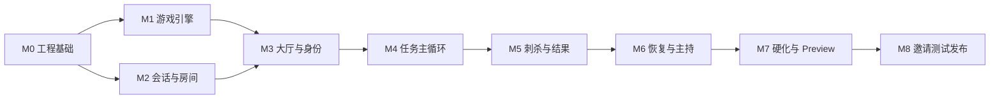

# Avalon MVP 实施路线图

> 状态：P0 基线
>
> 用途：定义依赖、里程碑成果与退出门槛；不在本文维护实时完成百分比
>
> 实时任务权威：GitHub Issues + GitHub Project（创建后）

## 1. 交付原则

- 按可运行纵向切片交付，不先堆满所有页面或所有服务器端点；
- 游戏引擎与协议先于依赖它们的服务端/客户端；
- 每个里程碑结束都必须有可执行证据，不能以“代码已写”作为退出条件；
- 规则、投影和协议属于共享高冲突区域，先合并共享变更，再并行开发消费者；
- 开发、Preview 与 Production 环境严格分离；生产部署、付费和商店提交是人工门槛；
- 本路线图只在里程碑范围/门槛改变时更新；Issue 状态不回写成文档复选框。

## 2. 里程碑依赖



M1 与 M2 可在 M0 后有限并行，但不得同时修改未合并的协议 Schema。M8 不属于“Codex 可无条件自主完成”的范围，包含测试分发账号、签名、法律和生产授权。App Store/Google Play 公开发布不属于本 MVP 路线图，公开发布前必须重新进行产品、安全、隐私和容量评审。

## 3. 开工前人工决策门槛

| ID | 最迟时间 | 需要决定 | 默认/影响 |
| --- | --- | --- | --- |
| `M0-GATE-01` | M0 结束前 | 云供应商、部署区域、预算上限、数据库/Redis 服务 | 不决定则只完成供应商无关本地栈和适配器 |
| `M0-GATE-02` | M0 结束前 | GitHub 仓库、Issue/Project、分支保护与 CI 权限 | 不决定则本地开发可继续，不能建立完整远端流程 |
| `M0-GATE-03` | M0 结束前 | App 暂定名称、iOS bundle ID、Android application ID | 不决定则使用不可发布占位 ID，后续需迁移 |
| `M1-GATE-01` | M1 结束前 | 品牌方向、明暗主题、字体/角色美术策略 | 不阻塞逻辑，但阻塞稳定视觉组件和商店素材 |
| `M3-GATE-01` | M3 前 | 中文主持声音、录制/生成方式与商业授权 | 可用占位音频开发，不能进入发布候选 |
| `M7-GATE-01` | M7 前 | 无历史/终局清除政策、隐私说明、桌游名称和资产法律审查 | 不满足不得开始外部邀请测试 |
| `M8-GATE-01` | M8 | Expo/EAS、TestFlight/Play Closed testing、域名、监控等生产账号和密钥 | 必须由所有者提供/授权，Codex 不创建付费承诺 |

## 4. M0：工程基础与可重复开发

### 目标

从空仓库得到可安装、可构建、可测试的 TypeScript monorepo，以及协议/文档的自动校验回路。

### 建议 Issue

| ID | 交付物 | 主要追踪 |
| --- | --- | --- |
| `M0-001` | 锁定 Node/pnpm，创建 workspaces、根脚本和目录边界 | `ADR-001`、`AGENTS.md` |
| `M0-002` | 用显式稳定 SDK 创建 `apps/mobile` Expo Router/CNG 项目 | `ADR-005`、`UX-001`–`UX-005` |
| `M0-003` | 创建 Fastify/Socket.IO 服务骨架、配置校验和健康端点 | `ADR-002`、API 第 3 节 |
| `M0-004` | 创建 `packages/game-engine`、`protocol`、`test-fixtures` 公共入口 | `ADR-001`、`ADR-007` |
| `M0-005` | 把 bootstrap JSON Schema 转换为可生成 TypeScript Schema，建立快照检查 | API、`TEST-contract` |
| `M0-006` | 本地 PostgreSQL/Redis 开发栈、迁移工具与测试容器 | `ADR-003` |
| `M0-007` | CI：format/lint/typecheck/unit/contract/docs/secret scan | 测试策略第 11 节 |
| `M0-008` | `.env.example`、配置字段允许列表、开发启动与故障排查 README | `NFR-012`、`NFR-023` |
| `M0-009` | 建立开发/Preview EAS profile 与首个 Development Build | `ADR-005` |

### 退出门槛

- 干净 checkout 可按 README 一次安装并启动 mobile/server/local dependencies；
- iOS 与 Android 至少各有一个 Development Build 冒烟通过；
- 根 `format:check/lint/typecheck/test/test:contract/docs:check` 全部通过；
- Schema 生成无 diff，健康端点不泄漏配置；
- CI 与本地命令一致；所有未决人工 gate 已决定或明确以适配器/占位项隔离。

## 5. M1：纯游戏引擎与规则证明

### 目标

实现不依赖网络、数据库或 UI 的 `CLASSIC_AVALON_V1` 权威状态转换，并以确定性测试覆盖全部规则。

### 建议 Issue

| ID | 交付物 | 主要追踪 |
| --- | --- | --- |
| `M1-001` | 领域类型、人数/任务表、角色牌组和配置校验 | `RULE-001`–`RULE-004`、`AC-001`–`AC-002` |
| `M1-002` | CSPRNG 端口、发牌、首位队长和私密知识计算 | `RULE-005`–`RULE-007`、`AC-008` |
| `M1-003` | 组队/投票状态转换、平票和五次否决 | `RULE-008`–`RULE-011`、`AC-003`–`AC-004` |
| `M1-004` | 任务选择、匿名结算与双失败阈值 | `RULE-012`–`RULE-016`、`AC-005`–`AC-006` |
| `M1-005` | 三次成功、刺杀、胜负终态 | `RULE-017`–`RULE-019`、`AC-007` |
| `M1-006` | 暂停覆盖、在线选民终止投票、音频副作用描述和不变量 | `RULE-020`–`RULE-023` |
| `M1-007` | 表驱动、性质/模型和回归测试套件 | 测试策略第 4 节 |

### 退出门槛

- 5–10 人全表、所有特殊角色知识、平票/五拒/三成/三败/刺杀测试通过；
- 每个 `SM-*` 领域命令有成功和主要失败测试；
- 生成合法命令序列无不变量反例，失败种子可复现；
- `game-engine` 依赖图不含网络、数据库、React、Expo 或系统随机/时间直接调用。

## 6. M2：会话、建房、加入与实时骨架

### 目标

用户可通过手输/公开链接建立安全会话并在多实例可恢复的权威房间中看到个性化投影。

### 建议 Issue

| ID | 交付物 | 主要追踪 |
| --- | --- | --- |
| `M2-001` | 房间/玩家/会话/processed command/Outbox 数据迁移 | `ADR-003`、`NFR-007` |
| `M2-002` | 创建/加入 API、幂等和房间号限流 | `SM-001`–`SM-002`、`FR-001`–`FR-005` |
| `M2-003` | SessionToken 摘要、SecureStore、恢复轮换与撤销 | `SM-003`、`FR-006`、`NFR-010` |
| `M2-004` | Socket.IO 鉴权、命令 ack、Outbox 和 `RoomView` | API 第 4 节、`ADR-004` |
| `M2-005` | 首页、创建、手输房间号、扫码/深链 | `UX-001`–`UX-005`、`AC-013` |
| `M2-006` | 双实例并发/崩溃/重连集成测试 | `AC-009`、`NFR-006`–`NFR-007` |

### 退出门槛

- 两台客户端可建房/加入并实时看到一致玩家列表；
- token 不出现在数据库明文、日志、URL 或普通存储；
- 相同/冲突幂等键、并发加入、恢复轮换和失效路径通过；
- 实例在事务/ack/Outbox 各崩溃点恢复，无重复房间或丢失确认；
- 非法 QR、房间枚举和拒绝相机有可用替代流程。

## 7. M3：大厅、配置与身份揭示

### 目标

5–10 名玩家可完成座次、配置、准备、开局和无越权身份揭示。

### 建议 Issue

| ID | 交付物 | 主要追踪 |
| --- | --- | --- |
| `M3-001` | 大厅列表、二维码、准备、退出/移除/关闭 | `FR-003`、`FR-007`–`FR-009`、`FR-014`–`FR-016` |
| `M3-002` | 座次重排和配置编辑/错误映射 | `FR-010`–`FR-013` |
| `M3-003` | StartGame 事务、发牌与每玩家投影 | `SM-007`、`FR-015`、`FR-017`–`FR-018` |
| `M3-004` | 身份隐私门、后台遮罩和 AckRole | `UX-008`、`FR-019`–`FR-020` |
| `M3-005` | 角色知识矩阵/代理/日志泄漏测试 | `AC-008`、`AC-015` |

### 退出门槛

- 5–10 人两个预设和自定义错误完整通过；
- 角色与首位队长只分配一次，配置/座次开局后冻结；
- 8 个角色视角通过投影允许列表，公开网络/日志无角色秘密；
- 最大字体与读屏可安全完成身份确认；
- 发牌后 UI 不提供退出、移除或替补。

## 8. M4：组队、投票与任务主循环

### 目标

实现从第一次组队到任务结算的完整循环，覆盖所有人数、平票、五拒和双失败规则。

### 建议 Issue

| ID | 交付物 | 主要追踪 |
| --- | --- | --- |
| `M4-001` | 公共桌面、任务轨道、阶段门和房主继续 | `FR-021`–`FR-022` |
| `M4-002` | 队长选择与 SubmitTeam | `FR-023`、`AC-002` |
| `M4-003` | 私密组队票、总进度与同时公开 | `FR-024`–`FR-026`、`AC-003`–`AC-004` |
| `M4-004` | 私密任务行动、善方约束与中性等待 | `FR-027`–`FR-028`、`AC-005` |
| `M4-005` | 匿名结算、双失败、历史与下一任务 | `FR-029`–`FR-031`、`AC-006` |
| `M4-006` | 并发最后提交与网络/遥测秘密扫描 | `AC-009`、`AC-015` |

### 退出门槛

- 头部 5–10 客户端能自动完成完整五轮路径；
- 投票结算前不显示提交者/票值，任务行动永不关联玩家公开；
- 重复/并发最后提交只结算一次；
- 平票、五拒和第四轮阈值在 UI 与服务器一致；
- iOS/Android 各通过一次真实私密提交和结果流程。

## 9. M5：刺杀、终局与会话清理

### 目标

完成所有胜因、角色公开、结果历史、房间关闭和本地秘密清理。

### 建议 Issue

| ID | 交付物 | 主要追踪 |
| --- | --- | --- |
| `M5-001` | 三成进入刺杀、刺客候选和二次确认 | `FR-032`–`FR-033` |
| `M5-002` | 四种阵营胜因与 ABORTED 结果 | `FR-034`、`GameOutcome` |
| `M5-003` | 全角色揭示和公开历史 | `RULE-019`、`UX-015` |
| `M5-004` | 终局确认/60 秒超时后的服务端清除，以及客户端 token、投影和私密内存清理 | `NFR-016`、`NFR-022`、`TM-009` |

### 退出门槛

- 三败、五拒、刺杀命中/未命中和 ABORTED 均有正确结果；
- 刺杀前角色仍保密，候选不按阵营过滤；
- 结束后仍无任务行动归属；
- 房间关闭/过期后本机无法恢复旧角色或 token。

## 10. M6：断线恢复与固定语音主持

### 目标

弱网和音频中断下对局保持公平、可恢复且不重复主持。

### 建议 Issue

| ID | 交付物 | 主要追踪 |
| --- | --- | --- |
| `M6-001` | 心跳、10 秒暂停、多暂停原因、在线选民终止投票与 60 分钟硬上限 | `FR-040`–`FR-049` |
| `M6-002` | 前后台/连接缺口重同步与错误状态 | `FR-042`、`FR-046`–`FR-047` |
| `M6-003` | 音频/字幕包校验、播放、静音与预检 | `FR-016`、`FR-035`–`FR-039` |
| `M6-004` | audio cue LIVE/RESYNC 去重和主动重播 | `SM-016`、`AC-012` |
| `M6-005` | 普通玩家/房主断线与音频中断原生 E2E | `AC-010`–`AC-012` |

### 退出门槛

- 掉线、回前台和滚动重启恢复到同一状态，不丢已确认动作；
- 房主掉线不转移权力，多个暂停原因正确合并/清除；
- 重连、重复投影、系统音频中断不自动重复，主动重播只一次；
- 音频损坏时字幕完成全流程；固定音频与字幕通过内容/授权审核。

## 11. M7：安全、容量与 Preview 就绪

### 目标

把功能完整构建提升到安全、可观测、可恢复且具备发布级容量的 Preview 就绪候选。本里程碑不创建云资源、不签名或分发 EAS 构建，完成状态固定为 `PREVIEW_READY_NOT_DEPLOYED`。

### 建议 Issue

| ID | 交付物 | 主要追踪 |
| --- | --- | --- |
| `M7-001` | 威胁模型高优先缓解和安全扫描 | `TM-*`、`NFR-012`–`NFR-017` |
| `M7-002` | VoiceOver/TalkBack、动态字体、对比度和减少动态 | `NFR-018`–`NFR-020`、`AC-014`；**延期，不在 M7 开发** |
| `M7-003` | 允许列表日志/指标、崩溃采集和告警 | `NFR-008`、`NFR-023` |
| `M7-004` | 1,000 房/10,000 连接负载与容量修复 | `NFR-002`–`NFR-004` |
| `M7-005` | 故障注入、迁移/备份恢复和滚动回滚演练 | `NFR-006`–`NFR-007` |
| `M7-006` | fail-closed Preview 检查、AWS/GCP/EAS 操作手册及 `AC-001`–`AC-013`、`AC-015` 回归 | 发布门槛 |

### 退出门槛

- `AC-001`–`AC-013`、`AC-015` 与 `NFR-002`–`NFR-017`、`NFR-021`–`NFR-024` 中适用项通过，无未处理 critical/high 安全风险；
- 完整负载 30 分钟达标且无秘密扫描命中；
- Preview 配置、回滚、监控、隐私/资产/依赖清单可按手册执行，但真实安装与云端验证仍为人工未执行项；
- 已知中低风险有 owner、Issue 和上线接受决定。

`NFR-018`–`NFR-020` 和 `AC-014` 不删除、不视为通过；M8 的外部邀请就绪声明继续受其决策与真机验证阻塞。

## 12. M8：邀请测试发布（人工授权阶段）

### 目标

完成生产基础设施、TestFlight/Play Closed testing 材料、签名、隐私说明、受邀分发和回滚值守。

Codex 可以准备配置、检查清单、测试分发文案和自动化，但不得在没有明确单次授权时购买服务、上传生产密钥、提交测试分发审核、推送生产或邀请外部测试者。

退出门槛包括：生产 secrets/KMS、暂态对局数据不进入长期备份、域名/TLS、告警/值班、隐私说明、资产授权、测试渠道隐私表、签名构建、邀请名单与回滚负责人均确认。

未来公开上架应建立独立 M9：重新评估无账号滥用、DDoS、公开发现、合规、商店审核、客服和事件响应；不得把邀请测试的风险接受直接沿用到公开发布。

## 13. Issue 模板与看板

### 13.1 Issue 正文

```markdown
## Outcome
可观察的用户/系统结果。

## Traceability
RULE-xxx, SM-xxx, FR-xxx, NFR-xxx, AC-xxx, TM-xxx

## In scope / Out of scope
明确边界。

## Acceptance criteria
- [ ] Given/When/Then 或可执行断言

## Verification
- 命令、测试层、设备和 UI 证据

## Dependencies / Risks
- 前置 Issue、Schema、人工 gate、秘密/迁移风险
```

### 13.2 看板字段

`Milestone`、`Status`、`Priority`、`Area`、`Risk`、`Blocked by`、`Trace IDs`。状态建议只有 `Backlog → Ready → In progress → Review → Verified → Done`；外部等待用 `Blocked` 标记而不伪装成进行中。

### 13.3 Definition of Ready

Issue 进入 Ready 前必须有明确 outcome、上游规范/编号、边界、依赖、验收和可获得的测试环境。规则/协议仍冲突、需要未批准付费服务或缺少必要设计决定时不得开始。

### 13.4 Definition of Done

遵循根 `AGENTS.md` 第 7 节；Project 只有在实现、验证、文档/Schema、UI 证据和风险记录全部完成后才能标 Done。

## 14. Codex 自主执行协议

每次长运行目标应指定一个里程碑或一组无冲突的 Ready Issues，不使用“把整个 App 做完”作为不可审查单元。推荐目标模板：

```text
以 AGENTS.md、docs/ 与 GitHub Project 为权威来源，按依赖顺序完成 Mx 中
所有 Ready Issues。每个 Issue 都实现、测试、更新 Schema/文档并保留 UI
证据；CI 绿色后进入下一个。仅在 AGENTS.md 的人工门槛、规范冲突或外部
凭证阻塞时暂停，不因普通实现选择反复请求确认。
```

并行规则：游戏引擎、移动视觉和服务基础设施可在稳定协议上并行；禁止多个工作任务同时编辑相同 Schema、迁移或状态枚举。合并后每个消费者必须重新运行契约测试。
