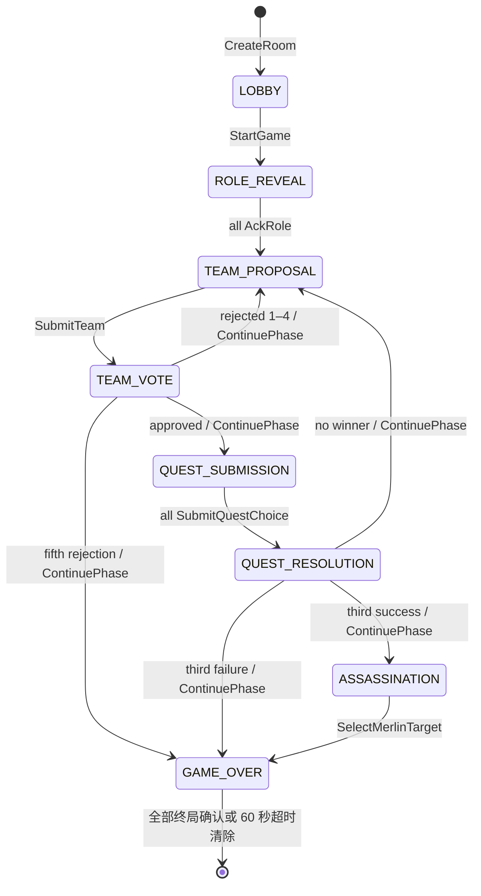
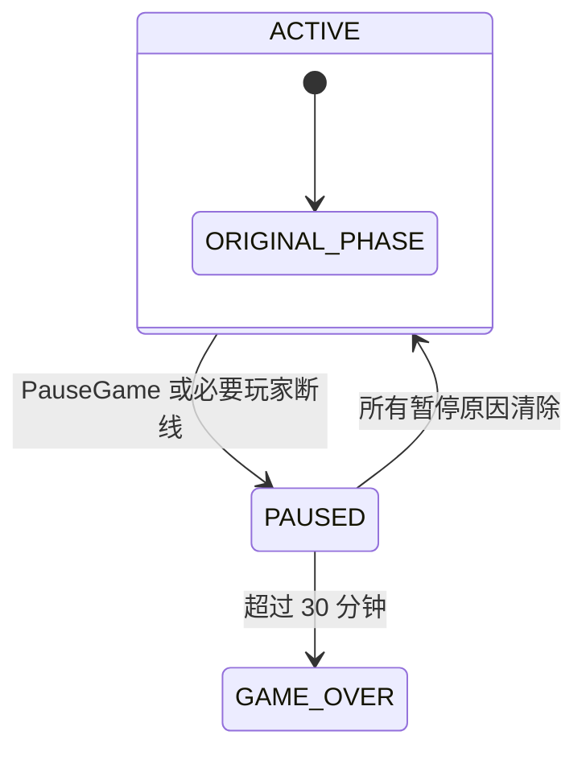

# 阿瓦隆服务端权威状态机规范

> 文档状态：MVP 实现规范
>
> 依赖规则：[阿瓦隆移动端游戏规则规范](./game-rules.zh-CN.md)
>
> 规则版本：`CLASSIC_AVALON_V1`
>
> 原则：服务端是唯一裁决者；客户端只提交意图并渲染服务端投影。

## 1. 目标与边界

本文定义云端房间的状态、命令、事件、权限、私密投影、错误、重连和幂等语义，使服务端可以在不重新解释游戏规则的情况下实现 MVP。

本文不绑定编程语言、数据库、消息中间件或 WebSocket 框架。HTTP 与持久实时连接只是协议职责划分：创建、加入和恢复使用请求式接口；对局命令与状态事件使用实时连接。

服务端不处理线下讨论内容，也不录音。湖中仙女、王者之剑、崔斯坦与伊索尔德不进入 `CLASSIC_AVALON_V1`。

## 2. 核心类型

### 2.1 标识与枚举

| 类型 | 允许值/约束 |
| --- | --- |
| `RoomId` | 服务端内部不可变 UUID，不展示给玩家。 |
| `RoomCode` | 6 位无歧义大写 Base32 字符，大小写不敏感，用于人工输入。 |
| `PlayerId` | 房间内不可变 UUID。 |
| `SessionToken` | 至少 128 位随机熵，只在创建、加入或恢复响应中下发。 |
| `RulesVersion` | MVP 固定为 `CLASSIC_AVALON_V1`。 |
| `RoleId` | `MERLIN`、`LOYAL_SERVANT`、`PERCIVAL`、`ASSASSIN`、`MINION`、`MORGANA`、`MORDRED`、`OBERON`。 |
| `Alignment` | `GOOD`、`EVIL`。 |
| `TeamVote` | `APPROVE`、`REJECT`。 |
| `QuestChoice` | `SUCCESS`、`FAIL`。 |
| `PhaseStage` | `HOST_HELD`、`COLLECTING`、`RESOLVED`。 |

### 2.2 `GamePhase`

```text
LOBBY
ROLE_REVEAL
TEAM_PROPOSAL
TEAM_VOTE
QUEST_SUBMISSION
QUEST_RESOLUTION
ASSASSINATION
GAME_OVER
PAUSED
```

- `HOST_HELD`：已进入阶段并展示/播放提示，但尚未接受玩家动作；房主使用 `ContinuePhase` 开放该阶段。
- `COLLECTING`：接受本阶段所需命令。
- `RESOLVED`：裁决已经锁定，只等待房主展示完成后继续；不得修改裁决输入。
- `PAUSED` 保存被中断的 `phase`、`stage` 和暂停原因集合；它不是重新开始阶段。

### 2.3 `RoomConfigInput` 与 `RoomConfig`

`RoomConfigInput` 包含固定的 `rulesVersion`、5–10 的 `playerCount`、`locale=zh-CN` 和以下两种互斥的 `roleSelection` 之一：

```json
{ "type": "PRESET", "presetId": "CLASSIC" }
```

```json
{
  "type": "CUSTOM",
  "roleIds": ["MERLIN", "PERCIVAL", "LOYAL_SERVANT", "ASSASSIN", "MORGANA"]
}
```

`presetId` 只允许 `CLASSIC` 或 `COMMON_ROLES`。服务端按玩家人数展开预设，用普通忠臣/爪牙补足阵营名额，再执行与自定义配置相同的完整校验。服务端根据客户端支持的内置资源版本选择 `voicePackVersion`；没有兼容版本时拒绝开始。持久化聚合只保存规范化后的 `RoomConfig`，不依赖客户端如何命名或展开预设。

```json
{
  "rulesVersion": "CLASSIC_AVALON_V1",
  "playerCount": 7,
  "roleIds": [
    "MERLIN",
    "PERCIVAL",
    "LOYAL_SERVANT",
    "LOYAL_SERVANT",
    "ASSASSIN",
    "MORGANA",
    "MINION"
  ],
  "locale": "zh-CN",
  "voicePackVersion": "zh-CN-v1"
}
```

校验必须实施规则文档第 5.1 节和第 8.3 节的全部硬约束。角色数组表示牌组，不表示角色与座次的对应关系。

### 2.4 `RoomAggregate`

| 字段 | 类型 | 说明 |
| --- | --- | --- |
| `roomId` / `roomCode` | 标识 | 内部标识与玩家可输入房间号。 |
| `stateVersion` | 非负整数 | 每个成功改变聚合的事务递增 1。 |
| `config` | `RoomConfig` | 开局后冻结。 |
| `phase` / `phaseStage` | 枚举 | 当前主状态与阶段门。 |
| `resumePoint` | 可空对象 | `PAUSED` 时保存原 `phase`、`stage`。 |
| `pauseReasons` | 集合 | `MANUAL`、`PLAYER_DISCONNECTED`、`HOST_DISCONNECTED`。 |
| `manualPauseReason` | 可空文本 | NFC 规范化后的公开手动原因；禁止控制和双向格式字符。 |
| `recoveryStartedAt` / `recoveryExpiresAt` | 可空时间 | 首次服务端确认暂停时建立；原因叠加不延长，全部清除后清空。 |
| `players` | 有序数组 | 包含玩家标识、昵称、座次、房主标志、准备与连接状态。 |
| `hostPlayerId` | `PlayerId` | 开局前后均不可自动转移。 |
| `leaderSeatIndex` | 整数 | 当前队长的固定座次索引。 |
| `questIndex` | 1–5 | 当前任务序号。 |
| `proposalAttempt` | 1–5 | 当前任务的组队尝试次数。 |
| `proposedTeam` | `PlayerId[]` | 当前队伍；新尝试开始时清空。 |
| `teamVotes` | 私密映射 | 当前尝试每名玩家的组队票。 |
| `proposalHistory` | 数组 | 已公开的组队尝试、队长、队伍、逐人票值及是否通过；结算前不写入。 |
| `questChoices` | 私密映射 | 当前任务队员的任务行动。永不进入公开投影。 |
| `questHistory` | 数组 | 已结算任务、匿名票数、结果，以及关联的获批组队尝试。 |
| `successCount` / `failureCount` | 0–3 | 已结算任务累计。 |
| `roleAssignments` | 私密映射 | 玩家到角色；游戏结束前不得公开。 |
| `privateKnowledge` | 私密映射 | 服务器预计算的每玩家可知信息。 |
| `pendingTransition` | 可空枚举 | 结算展示完成后前往 `NEXT_PROPOSAL`、`NEXT_QUEST`、`ASSASSINATION` 或 `GAME_OVER`。 |
| `gameOutcome` | 可空 `GameOutcome` | 胜方、胜因、刺杀目标或 `ABORTED`。一旦设置不可修改；只保留到终局投影完成投递/超时清除。 |
| `currentAudioCue` | 可空 `AudioCue` | 当前固定语音提示及唯一播放实例。 |
| `processedCommands` | 去重记录 | `commandId`、请求摘要和原始响应；保留至房间销毁。 |
| `createdAt` / `lastActiveAt` | 时间 | 生命周期与过期判定。 |

### 2.5 `GameOutcome`

| `reason` | `winner` | 触发条件 |
| --- | --- | --- |
| `THREE_QUEST_FAILURES` | `EVIL` | `RULE-016`。 |
| `FIVE_REJECTED_TEAMS` | `EVIL` | `RULE-011`。 |
| `MERLIN_ASSASSINATED` | `EVIL` | `RULE-019`，刺杀命中。 |
| `MERLIN_SURVIVED` | `GOOD` | `RULE-019`，刺杀未命中。 |
| `ABORTED` | `NONE` | 活跃对局暂停超过恢复期限或发生不判定阵营胜负的系统终止；大厅关闭不生成对局结果。 |

## 3. 状态图

### 3.1 主流程



每次进入 `ROLE_REVEAL`、`TEAM_PROPOSAL`、`TEAM_VOTE`、`QUEST_SUBMISSION` 或 `ASSASSINATION` 时，初始 `phaseStage=HOST_HELD`；房主调用 `ContinuePhase` 后变为 `COLLECTING`。`TEAM_VOTE` 全员提交和 `QUEST_SUBMISSION` 全员提交会自动裁决，并变为 `RESOLVED`。规则胜负在裁决事务中立即锁定，`ContinuePhase` 只完成结果展示后的页面迁移，不延迟或改变裁决。

### 3.2 暂停覆盖层



- `LOBBY` 不切换为 `PAUSED`，仅更新玩家在线状态；房主离线 30 分钟后房间过期。
- 从 `ROLE_REVEAL` 到 `ASSASSINATION`，任一玩家心跳连续丢失并达到 10 秒即增加连接暂停原因。
- 所有玩家恢复在线时，系统移除连接暂停原因；若没有其他暂停原因，恢复原 `phase` 和 `stage`。
- 手动暂停只能由房主解除。房主断线不会触发控制权转移。
- 恢复时不清空提交、不重新发牌、不递增任务或尝试次数，也不自动重播语音。

## 4. 命令协议

### 4.1 `Command` 信封

所有实时命令使用统一信封：

```json
{
  "commandId": "0194f1a2-8d91-7a04-93c9-84b8bf856ca1",
  "roomId": "8ff09e6e-e191-4c57-89cb-c38d0ca62f93",
  "expectedStateVersion": 42,
  "type": "SubmitTeamVote",
  "payload": { "vote": "APPROVE" },
  "sentAt": "2026-08-12T10:15:30Z"
}
```

身份从已认证实时连接关联的 `SessionToken` 获取，命令不得接受调用方传入任意 `actorPlayerId`。

### 4.2 幂等、并发与持久化

1. 首次接受 `commandId` 时，服务端必须在同一事务中校验命令、写入聚合/事件、保存去重记录并递增 `stateVersion`，持久化成功后才确认客户端。
2. 相同 `commandId` 且请求摘要相同：返回首次响应，不重复改变状态、不重复发出领域事件。
3. 相同 `commandId` 但请求摘要不同：返回 `DUPLICATE_COMMAND_CONFLICT`。
4. 未命中去重记录且 `expectedStateVersion` 不是当前版本：返回 `STALE_VERSION` 和获取最新投影的提示。
5. 同一玩家的两个合法并发提交只能有一个在版本检查后成功。
6. 自动结算与触发它的最后一个提交处于同一事务，客户端不得承担计票或胜负计算。

`CreateRoom`、`JoinRoom` 和 `ResumeSession` 不使用实时命令信封：请求端通过 `Idempotency-Key` 提供 `commandId` 等价物。创建没有 `expectedStateVersion`；加入在服务端事务内校验房间仍处于大厅且仍有空位；恢复按会话令牌定位最新聚合。三者适用相同的“同一键同一请求返回首次响应、同一键不同请求报冲突”规则。

### 4.3 命令目录

下表中的“公开”指进入 `PublicSnapshot` 或公开事件；“私密”指只返回命令发起者或特定玩家。

| ID / 命令 | 执行者与载荷 | 前置条件与权限 | 状态变化、事件与投影 | 下一状态/主要错误 |
| --- | --- | --- | --- | --- |
| `SM-001 CreateRoom` | 未登录访客；昵称、`RoomConfigInput` | 配置合法；昵称合法 | 规范化配置，创建房间与房主座次；公开 `RoomCreated`；私密返回 `SessionToken` | `LOBBY`；`INVALID_CONFIG`、`INVALID_NICKNAME` |
| `SM-002 JoinRoom` | 未登录访客；房间号、昵称 | 房间存在、处于 `LOBBY`、未满、昵称不冲突 | 追加座次；公开 `PlayerJoined`；私密返回 `PlayerId`、`SessionToken` | `LOBBY`；`INVALID_ROOM_CODE`、`ROOM_FULL`、`ROOM_NOT_JOINABLE`、`NICKNAME_CONFLICT` |
| `SM-003 ResumeSession` | 持有会话令牌的玩家；令牌 | 房间未过期且令牌有效 | 标记在线；公开连接变化；私密返回最新公开快照和个人投影 | 原状态；`SESSION_INVALID`、`ROOM_EXPIRED` |
| `SM-004 ConfigureRoom` | 房主；完整 `RoomConfigInput` | 仅 `LOBBY`，角色与人数合法 | 规范化并替换配置，将所有玩家 `ready=false`；公开新配置 | `LOBBY`；`NOT_HOST`、`INVALID_CONFIG` |
| `SM-005 ReorderSeats` | 房主；完整有序 `PlayerId[]` | 仅 `LOBBY`；列表必须恰好包含当前玩家各一次 | 原子更新座次并重置准备；公开新顺序 | `LOBBY`；`NOT_HOST`、`INVALID_SEAT_ORDER` |
| `SM-006 SetReady` | 任意玩家；布尔值 | 仅 `LOBBY`；玩家在线 | 更新本人准备状态；公开该状态 | `LOBBY`；`INVALID_PHASE` |
| `SM-007 StartGame` | 房主；无 | 人数等于目标、全员在线且准备、配置合法 | CSPRNG 随机分配角色与首位队长，冻结配置；公开 `GameStarted`；每人私密获得角色知识；创建开场语音 | `ROLE_REVEAL/HOST_HELD`；`NOT_HOST`、`PLAYERS_NOT_READY`、`INVALID_CONFIG` |
| `SM-008 ContinuePhase` | 房主；无 | 当前为 `HOST_HELD` 或 `RESOLVED` 且未暂停 | `HOST_HELD→COLLECTING`；或按已锁定 `pendingTransition` 前进并生成下一提示 | 由当前阶段决定；`NOT_HOST`、`INVALID_PHASE_STAGE` |
| `SM-009 AckRole` | 任意玩家；无 | `ROLE_REVEAL/COLLECTING`；本人未确认 | 仅公开确认总数，私密确认本人成功；全员确认后清空确认集合并生成组队提示 | 未齐保持原状态；全员齐后 `TEAM_PROPOSAL/HOST_HELD`；`ALREADY_SUBMITTED` |
| `SM-010 SubmitTeam` | 当前队长；`teamPlayerIds` | `TEAM_PROPOSAL/COLLECTING`；人数正确、成员唯一且属于房间 | 保存队伍；公开队伍和 `TeamProposed`；清空旧票并生成投票提示 | `TEAM_VOTE/HOST_HELD`；`NOT_LEADER`、`INVALID_TEAM_SIZE`、`INVALID_TEAM_MEMBER` |
| `SM-011 SubmitTeamVote` | 每名玩家；`APPROVE/REJECT` | `TEAM_VOTE/COLLECTING`；本人未提交 | 提交前仅本人收到确认，公开只更新总提交数；全员齐后自动计票并公开每人票值，锁定 `pendingTransition` | `TEAM_VOTE/RESOLVED`；`ALREADY_SUBMITTED`、`INVALID_VOTE` |
| `SM-012 SubmitQuestChoice` | 获批队员；`SUCCESS/FAIL` | `QUEST_SUBMISSION/COLLECTING`；本人未提交；善方不得提交 `FAIL` | 选择始终私密；公开仅更新总提交数；全员齐后匿名计票、写历史和比分、锁定后继与结果提示 | `QUEST_RESOLUTION/RESOLVED`；`PLAYER_NOT_ON_TEAM`、`GOOD_CANNOT_FAIL`、`ALREADY_SUBMITTED` |
| `SM-013 SelectMerlinTarget` | 刺客；`targetPlayerId` | `ASSASSINATION/COLLECTING`；目标属于房间且不是刺客本人 | 比较目标与梅林，设置最终结果；公开全部角色、胜方和胜因 | `GAME_OVER/RESOLVED`；`NOT_ASSASSIN`、`INVALID_TARGET` |
| `SM-014 PauseGame` | 房主；可选公开原因 | 活跃对局且不在 `GAME_OVER` | 保存恢复点并加入 `MANUAL`；公开暂停原因，不改变私密数据 | `PAUSED`；`NOT_HOST`、`INVALID_PHASE` |
| `SM-015 ResumeGame` | 房主；无 | `PAUSED` 且包含 `MANUAL` | 移除手动原因；无其他原因时恢复原状态；不重播提示 | `PAUSED` 或恢复点；`NOT_HOST`、`PLAYERS_OFFLINE` |
| `SM-016 ReplayAudioCue` | 房主；当前 `audioCueId` | 房间有可重播提示，音频版本存在 | 不改变规则状态；创建新的播放实例，标记 `replayOf`；所有人看到字幕，只有房主收到播放指令 | 原状态；`NOT_HOST`、`AUDIO_CUE_NOT_FOUND` |
| `SM-017 LeaveLobby` | 非房主玩家；无 | 仅 `LOBBY` | 删除玩家并压缩座次，重置全员准备；公开 `PlayerLeft`；撤销该会话 | `LOBBY`；`HOST_CANNOT_LEAVE`、`INVALID_PHASE` |
| `SM-018 KickLobbyPlayer` | 房主；目标玩家 | 仅 `LOBBY`；目标不是房主 | 删除目标并重置全员准备；公开 `PlayerRemoved`；撤销目标会话 | `LOBBY`；`NOT_HOST`、`INVALID_TARGET` |
| `SM-019 CloseRoom` | 房主；无 | 仅 `LOBBY` | 设置关闭标志，撤销连接、删除房间并释放房间号 | 终止；`NOT_HOST`、`INVALID_PHASE` |

`SM-020 ConnectionChanged` 和 `SM-021 ExpireRoom` 为系统命令：前者根据心跳更新在线状态并管理暂停原因；后者在房主离线、必要玩家离线或暂停持续 30 分钟后将房间终止为 `ABORTED`。系统命令也必须通过版本化事务执行，但没有客户端 `commandId`。

`TerminalViewAcknowledged` 是传输层收据，不是游戏命令，不改变 `stateVersion`。它只记录某个当前在线会话已接收指定终局版本；不得携带或改变游戏动作。

### 4.4 自动裁决

#### 组队票

```text
approveCount = count(vote == APPROVE)
approved = approveCount > floor(playerCount / 2)

if approved:
    pendingTransition = QUEST_SUBMISSION
else if proposalAttempt == 5:
    gameOutcome = EVIL / FIVE_REJECTED_TEAMS
    pendingTransition = GAME_OVER
else:
    leaderSeatIndex = nextSeat(leaderSeatIndex)
    proposalAttempt += 1
    pendingTransition = NEXT_PROPOSAL
```

公开计票时必须先把本次尝试追加到 `proposalHistory`。被否决时只有队长和尝试次数前进，`questIndex` 不变；房主继续到下一次组队时清空当前 `proposedTeam` 和 `teamVotes`，历史不清空。队伍获批时保留其历史记录并供任务历史关联。第五次否决事务立即锁定邪恶方胜利；展示结束前不接受任何游戏动作。

#### 任务

```text
requiredFails = (playerCount >= 7 && questIndex == 4) ? 2 : 1
questSucceeded = failCount < requiredFails

append questHistory
increment successCount or failureCount

if failureCount == 3:
    gameOutcome = EVIL / THREE_QUEST_FAILURES
    pendingTransition = GAME_OVER
else if successCount == 3:
    pendingTransition = ASSASSINATION
else:
    questIndex += 1
    proposalAttempt = 1
    leaderSeatIndex = nextSeat(leaderSeatIndex)
    pendingTransition = NEXT_QUEST
```

结算后必须清空 `questChoices` 并销毁可在线查询的玩家到任务选择映射，仅在受严格访问控制的短期事务数据中保留到事务完成；公开历史只存成功/失败票数，不存行动归属。

## 5. 领域事件与实时消息

### 5.1 `DomainEvent`

领域事件至少包含 `eventId`、`roomId`、`stateVersion`、`type`、`occurredAt`、`visibility` 和 `payload`。`visibility` 取值：

- `PUBLIC`：所有房间玩家可接收；
- `PLAYER`：仅指定 `recipientPlayerId`；
- `SERVER_ONLY`：仅用于持久化/审计，绝不下发客户端。

| 事件 | 可见性 | 必需内容 |
| --- | --- | --- |
| `RoomCreated`、`PlayerJoined`、`PlayerLeft`、`RoomConfigured` | `PUBLIC` | 不含会话令牌。 |
| `GameStarted` | `PUBLIC` | 首位队长、规则版本，不含角色。 |
| `RoleAssigned` | `PLAYER` | 本人角色、阵营、说明与私密知识。 |
| `PhaseChanged` | `PUBLIC` | 阶段、阶段门、任务和尝试编号。 |
| `SubmissionProgressChanged` | `PUBLIC` | 仅 `submittedCount/requiredCount`，不含提交者。 |
| `TeamProposed` | `PUBLIC` | 队长与队伍。 |
| `TeamVoteRevealed` | `PUBLIC` | 全体玩家票值、总数和是否通过。 |
| `QuestResolved` | `PUBLIC` | 匿名成功/失败票数、结果和累计比分。 |
| `GameEnded` | `PUBLIC` | 胜方、胜因、全部角色和任务历史。 |
| `AudioCueRequested` | `PUBLIC` + 房主差异字段 | 所有人看到字幕键；只有房主的个人投影含 `shouldPlay=true`。 |
| `PlayerConnectionChanged`、`GamePaused`、`GameResumed` | `PUBLIC` | 在线/暂停状态，不含会话信息。 |
| `QuestChoiceAccepted` | `PLAYER` | 仅确认本人已提交，不回显给其他玩家。 |
| `RoleAssignmentsGenerated`、`QuestChoiceRecorded` | `SERVER_ONLY` | 严禁进入通用广播或日志正文。 |

### 5.2 `AudioCue`

```json
{
  "audioCueId": "cue-occurrence-92",
  "audioCueKey": "quest.result.failed",
  "voicePackVersion": "zh-CN-v1",
  "subtitleKey": "quest.result.failed",
  "phase": "QUEST_RESOLUTION",
  "shouldPlay": true,
  "replayOf": null,
  "createdAt": "2026-08-12T10:22:00Z"
}
```

- `audioCueKey` 只引用随应用发布的固定音频，不携带昵称、队伍或角色等动态内容。
- 房主客户端必须按 `audioCueId` 去重。重连返回当前提示，但 `shouldPlay=false`。
- `ReplayAudioCue` 生成新的 `audioCueId` 并填写 `replayOf`，因此是唯一允许的重复播放路径。
- 字幕文本必须来自与音频包同版本的固定资源；所有玩家可看到字幕，只有房主设备播放声音。

## 6. 状态投影与保密

### 6.1 `PublicSnapshot`

游戏结束前只允许包含：

```json
{
  "roomCode": "7K3M9Q",
  "stateVersion": 43,
  "rulesVersion": "CLASSIC_AVALON_V1",
  "phase": "TEAM_VOTE",
  "phaseStage": "COLLECTING",
  "players": [
    { "playerId": "p1", "nickname": "Arthur", "seat": 0, "isHost": true, "ready": true, "connected": true }
  ],
  "leaderPlayerId": "p3",
  "questIndex": 2,
  "proposalAttempt": 1,
  "requiredTeamSize": 3,
  "requiredQuestFails": 1,
  "proposedTeam": ["p2", "p3", "p6"],
  "submissionProgress": { "submittedCount": 4, "requiredCount": 7 },
  "questHistory": [],
  "successCount": 1,
  "failureCount": 0,
  "pauseReasons": [],
  "manualPauseReason": null,
  "recoveryStartedAt": null,
  "recoveryExpiresAt": null,
  "currentAudioCue": { "audioCueId": "cue-occurrence-51", "subtitleKey": "team.vote.prompt" }
}
```

`requiredQuestFails` 是当前任务的服务端权威失败阈值；7–10 人第四项任务为 2，其余任务为 1。已结算的 `proposalHistory` 条目必须包含服务端权威的 `approveCount` 与 `rejectCount`，客户端只负责展示，不得据此重新裁决。

它不得包含角色、阵营、私密知识、未公开票值、任务行动、会话令牌、设备标识或具体未提交玩家名单。

### 6.2 `PrivatePlayerProjection`

每条连接在公开快照之外只得到自己的个人投影：

| 字段 | 说明 |
| --- | --- |
| `selfRole` / `selfAlignment` | 本人角色和阵营。 |
| `knownPlayers` | 按规则文档第 7 节计算的玩家标识、知识标签；不得包含超出本人视角的信息。 |
| `availableActions` | 当前阶段本人可以执行的命令及合法静态选项。 |
| `hasSubmitted` | 仅本人的当前提交状态。 |
| `shouldPlayAudio` | 仅房主可能为真。 |
| `sessionExpiresAt` | 会话恢复信息，不进入公开投影。 |

任务行动选项必须服务端生成：善方只得到 `SUCCESS`，邪恶方得到 `SUCCESS` 和 `FAIL`。即使客户端被篡改，服务端仍按角色再次校验。

### 6.3 游戏结束投影

进入 `GAME_OVER` 后，终局投影增加所有玩家的 `roleId`、`alignment`、胜方、胜因、刺杀目标和完整公开历史；仍不得公开任务行动归属、会话令牌或服务端随机源。该投影只用于当前在线会话完成结果展示，不形成历史接口。

## 7. 请求式接口示例

### 7.1 创建房间

`POST /v1/rooms`

```json
{
  "nickname": "Arthur",
  "config": {
    "rulesVersion": "CLASSIC_AVALON_V1",
    "playerCount": 7,
    "roleSelection": { "type": "PRESET", "presetId": "COMMON_ROLES" },
    "locale": "zh-CN"
  }
}
```

响应包含 `roomCode`、`playerId`、只出现一次的 `sessionToken`、实时连接地址和初始个人化快照。

### 7.2 加入房间

`POST /v1/rooms/{roomCode}/players`

请求只包含昵称，房间号来自路径。二维码必须编码公开通用链接，例如 `https://app.example/join/7K3M9Q`，不得包含 `SessionToken`、`PlayerId` 或角色信息。

### 7.3 恢复会话

`POST /v1/sessions/resume`

客户端在 `Authorization: Bearer <SessionToken>` 头中提交令牌。服务端校验后轮换令牌，并返回 `PublicSnapshot`、当前玩家的 `PrivatePlayerProjection`、最新 `stateVersion` 和实时连接地址。旧令牌在成功轮换后失效。

## 8. 错误模型

`ErrorCode` 必须稳定、可本地化且不包含秘密数据。

| 错误码 | 语义/客户端处理 |
| --- | --- |
| `INVALID_ROOM_CODE` | 房间号格式或校验失败；停留加入页。 |
| `ROOM_FULL` | 房间已满；不创建会话。 |
| `ROOM_NOT_JOINABLE` | 已开始或关闭；引导返回首页。 |
| `ROOM_EXPIRED` | 房间保留期结束；清除本地会话。 |
| `SESSION_INVALID` | 会话令牌无效或已轮换；要求重新加入，仅限大厅。 |
| `NICKNAME_CONFLICT` / `INVALID_NICKNAME` | 要求修改昵称。 |
| `NOT_HOST` / `NOT_LEADER` / `NOT_ASSASSIN` | 权限不足；刷新个人投影，不泄漏额外身份。 |
| `INVALID_PHASE` / `INVALID_PHASE_STAGE` / `PHASE_HELD` | 命令不适用于当前状态；刷新快照。 |
| `STALE_VERSION` | 客户端状态过旧；获取最新投影后由用户重新确认动作。 |
| `DUPLICATE_COMMAND_CONFLICT` | 同一命令 ID 被不同请求复用；记录安全事件。 |
| `INVALID_CONFIG` / `INVALID_SEAT_ORDER` | 大厅配置不合法；显示字段级原因。 |
| `INVALID_TEAM_SIZE` / `INVALID_TEAM_MEMBER` | 队长重新选择队伍。 |
| `INVALID_VOTE` / `INVALID_TARGET` | 拒绝输入，不改变状态。 |
| `PLAYER_NOT_ON_TEAM` / `GOOD_CANNOT_FAIL` | 非法任务行动；只返回本人。 |
| `ALREADY_SUBMITTED` | 已有不同命令成功提交；客户端进入等待。 |
| `HOST_CANNOT_LEAVE` | 房主不能以普通退出离开大厅；可使用关闭房间。 |
| `PLAYERS_NOT_READY` / `PLAYERS_OFFLINE` | 显示公开阻塞原因，不显示秘密。 |
| `AUDIO_CUE_NOT_FOUND` | 提示不存在或版本不匹配；显示字幕并记录遥测。 |
| `UPGRADE_REQUIRED` | 客户端协议版本不受支持；阻止连接并引导更新。 |
| `RATE_LIMITED` | 创建、加入、握手或命令超过限额；按 `retryAfterMs` 延迟。 |
| `VALIDATION_ERROR` / `PAYLOAD_TOO_LARGE` | 传输结构或大小不合法；不得进入领域命令。 |
| `UNAUTHORIZED` | 缺少或无效会话；不区分 token 失败细节。 |
| `INTERNAL_ERROR` | 未分类服务错误；只返回匿名诊断码，不含堆栈或载荷。 |

## 9. 不变量与事务边界

每次事务提交前必须断言：

1. `players.length <= config.playerCount`，开局后严格相等；
2. 座次为从 0 开始且无重复、无空洞的序列；
3. 开局后角色与玩家一一对应，阵营数量合法；
4. 当前队伍无重复且人数符合任务表；
5. 组队票的键只能来自全部玩家，任务行动的键只能来自获批队伍；
6. 善方的任务行动不可能是 `FAIL`；
7. 公开任务历史不保存行动归属；
8. 成功数 + 失败数 = `questHistory.length`；
9. `gameOutcome != null` 后只允许终局投影、音频结果提示和传输层终局确认，不再接受游戏命令；
10. `PAUSED` 必须有非空暂停原因和有效恢复点。

### 9.1 终局清除与无历史原则

1. 产生 `GAME_OVER` 的事务必须同时写入最后聚合版本与终局 Outbox；
2. Outbox publisher 为当时全部在线会话生成个性化终局投影并开始 60 秒清除计时；
3. 客户端收到并持久到当前内存状态后发送 `TerminalViewAcknowledged(stateVersion)`；
4. 全部目标会话确认后立即删除房间聚合、玩家会话、processed commands、Outbox 和连接租约；没有全部确认也必须在 60 秒到期时删除；
5. 删除后创建/加入/恢复/读取均返回不可恢复的 `ROOM_EXPIRED`，房间号可按安全冷却策略回收；
6. 客户端结果只留在当前进程内存，离开结果页或进程结束即清除；
7. 服务端不得提供已结束对局列表、结果读取、运营检索或恢复接口；
8. 无 room/player/nickname 维度的聚合计数可以保留，但不能用于重建任何一局。

## 10. 规则到状态机追踪

| 规则 | 状态/命令 |
| --- | --- |
| `RULE-001`–`RULE-004` | `RoomConfig`、`SM-001`、`SM-004`、`SM-007` |
| `RULE-005` | `SM-005`、`SM-007`、队长轮换函数 |
| `RULE-006`–`RULE-007` | `ROLE_REVEAL`、`SM-009`、`PrivatePlayerProjection` |
| `RULE-008` | `TEAM_PROPOSAL`、`SM-010` |
| `RULE-009`–`RULE-011` | `TEAM_VOTE`、`SM-011`、组队票自动裁决 |
| `RULE-012`–`RULE-014` | `QUEST_SUBMISSION`、`SM-012`、任务自动裁决 |
| `RULE-015`–`RULE-017` | `QUEST_RESOLUTION`、`pendingTransition`、`GameOutcome` |
| `RULE-018`–`RULE-019` | `ASSASSINATION`、`SM-013` |
| `RULE-020`–`RULE-021` | `PhaseStage`、`SM-008`、`AudioCue` |
| `RULE-022` | `PAUSED`、`SM-003`、`SM-014`、`SM-015`、`SM-020`、`SM-021` |
