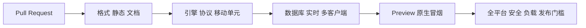

# Avalon MVP 测试策略

> 状态：P0 实现基线
>
> 目标：以自动化证据证明规则正确、秘密隔离、命令幂等、移动端可用与容量达标
>
> 依赖：[规则](./game-rules.zh-CN.md) · [状态机](./server-state-machine.zh-CN.md) · [FR/NFR](./mobile-fr-nfr.zh-CN.md) · [协议](./api-contract.zh-CN.md) · [UX](./ux-spec.zh-CN.md)

## 1. 质量风险排序

测试资源按以下风险排序：

1. 错误胜负、人数表、队长/尝试推进或角色知识；
2. 跨玩家秘密泄漏、非法任务行动和会话冒领；
3. 重复、并发、乱序、崩溃导致重复裁决或已确认动作丢失；
4. 断线后无法恢复、房主语音重复或对局永久卡住；
5. 原生扫码、安全存储、音频、后台隐私与无障碍失败；
6. 目标容量、延迟与可观测性不达标；
7. 非关键视觉和动效差异。

规则、协议和投影层必须主要依靠快速确定性测试；原生 E2E 用于验证真实平台集成，不重复穷举所有规则组合。

## 2. 测试层与工具基线

精确版本在 M0 锁定，工具选择变化需更新 ADR/本文。

| 层 | 默认工具 | 范围 | 运行频率 |
| --- | --- | --- | --- |
| 文档/静态 | 自定义 Node 脚本、Markdown/Mermaid/JSON Schema 校验 | 引用、编号、Schema、生成漂移、秘密字段黑名单 | 每个 PR |
| 游戏引擎 | Vitest + fast-check | 纯状态转换、规则表、不变量、性质测试 | 每个 PR |
| 协议契约 | Vitest + Ajv 2020 | HTTP/Socket Schema 正反例、兼容性、投影字段允许列表 | 每个 PR |
| 服务集成 | Vitest + Testcontainers 或 CI 服务容器 | Fastify、PostgreSQL、Redis、事务、Outbox、令牌轮换 | 每个 PR |
| 移动单元/组件 | Vitest/Jest 适配层 + React Native Testing Library | hooks、状态适配器、表单、页面状态、无障碍树 | 每个 PR |
| 头部多客户端 E2E | Node Socket.IO 测试客户端 | 5–10 玩家完整对局、断线、并发、权限 | 每个 PR 核心集；夜间全量 |
| 原生 E2E | Maestro（开发/预览构建） | iOS/Android UI、深链、权限、SecureStore、后台与音频入口 | 合并前核心集；夜间矩阵 |
| Expo Web 冒烟 | Playwright | 路由、响应布局和公开页面快速反馈 | 可选 PR 门槛，不替代原生 |
| 负载/韧性 | Artillery Socket.IO 场景 + 故障注入脚本 | 1,000 房/10,000 连接、滚动重启、Redis/DB 故障 | 夜间小型；候选发布全量 |
| 安全 | 依赖/秘密扫描 + 定向代理/授权测试 | token、枚举、越权、日志、投影、供应链 | 每个 PR 基础；发布前完整 |

若 Maestro 无法稳定控制任务切换器、来电或系统媒体中断，使用平台原生测试/人工真机协议补足，并记录不可自动化项。自动化多玩家规则流优先使用头部客户端，避免维护 5–10 台 UI 设备。

## 3. 环境与测试数据

### 3.1 环境

| 环境 | 数据 | 外部暴露 | 用途 |
| --- | --- | --- | --- |
| 单元 | 纯内存固定夹具 | 无 | 引擎、投影、组件 |
| 集成 | 临时 PostgreSQL/Redis | 仅 CI 网络 | 事务、鉴权、Outbox |
| 本地 E2E | 本地服务 + 模拟器/真机 | 开发机局域网 | 开发回路 |
| Preview | 隔离数据库、预览构建 | 受限测试者 | 原生回归、滚动部署、SLO 预检 |
| Load | 专用隔离栈 | 限制来源 | 容量与故障，不与 Preview/生产共库 |
| Production | 合成专用房间 | 互联网 | 无秘密的健康/建房/加入探针 |

测试不得连接生产数据库，不使用真实玩家昵称、生产 token、商店签名或可复用凭证。CI 日志和失败附件执行与生产相同的秘密字段过滤。

### 3.2 确定性夹具

`packages/test-fixtures` 必须提供：

- 5–10 人的规范昵称、座次和角色牌组；
- 经典/常用预设与每条自定义配置错误；
- 每个角色视角的期望 `knownPlayers`；
- 五轮任务规模和 7–10 人第四轮阈值；
- 同意、平票、否决、五拒、三成、三败、刺杀命中/未命中脚本；
- 固定 clock、UUID、CSPRNG 排列和 audio cue ID；
- 无效/过期/已轮换 token 的不可逆摘要夹具。

测试随机源必须通过引擎端口注入；生产构建应有静态检查，防止引用测试固定随机源。

## 4. 游戏引擎验证

### 4.1 表驱动规则测试

对 5–10 人逐行验证：

- 善恶阵营数量、牌组总数、梅林/刺客唯一；
- 五轮任务队伍人数；
- 仅 7–10 人第四次任务需要两张失败；
- 合法/非法预设、自定义依赖和唯一性；
- 初始 leader 在合法座次内，后续按固定座次循环。

### 4.2 命令状态转换

每个 `SM-001`–`SM-023` 至少覆盖：成功路径、错误操作者、错误阶段、错误 `phaseStage`、重复命令、过期版本、不变量保持和下一状态。自动裁决与最后提交在一个断言中验证，不能只测辅助计数函数。

### 4.3 性质与模型测试

使用生成式命令序列验证：

- 玩家数、座次、角色映射和阵营计数始终合法；
- `stateVersion` 对每个成功状态变更严格递增，对拒绝/相同幂等重试不增加；
- 每玩家每次投票最多一次，每队员每任务行动最多一次；
- 善方永远无法形成 `FAIL`；
- 成功 + 失败 = 已结算任务数，均不超过 3；
- `GAME_OVER` 的 winner/reason 不再改变；
- 任意合法游戏至多 5 个已结算任务并最终可达终态；
- 暂停/恢复不改变已接受提交、角色、队长、任务或 audio cue 播放实例；
- 终止投票选民固定为发起时在线集合，个人选择不进入公开投影；只有严格继续多数保留暂停；
- 对任务行动输入进行任意玩家重排，匿名计数相同且公开结果不含映射。

失败的生成序列必须能缩减并保存为回归夹具。

## 5. 协议与秘密投影测试

### 5.1 Schema

对每个 Schema 验证：规范正例、缺失必填、未知字段、边界长度、非法格式、非法枚举、超大数组和错误联合分支。生成文件必须格式稳定；源 Schema 变化后 `git diff` 可审查。

### 5.2 投影知识矩阵

对包含对应角色的合法牌组逐玩家构建投影，断言：

| 查看者 | 必须看到 | 必须看不到 |
| --- | --- | --- |
| 梅林 | 除莫德雷德外的邪恶标签，包括奥伯伦 | 具体邪恶角色、莫德雷德 |
| 派西维尔 | 梅林候选；有莫甘娜时两位不可区分候选 | 候选真实角色标签 |
| 刺客/爪牙/莫甘娜/莫德雷德 | 排除奥伯伦的已知邪恶同伴 | 奥伯伦、同伴具体角色 |
| 奥伯伦 | 无同伴信息 | 全部邪恶同伴 |
| 忠臣 | 无额外知识 | 任意阵营/角色信息 |

在每个阶段对网络 JSON、错误、日志、指标和测试快照扫描黑名单：`roleAssignments`、`questChoices`、`sessionToken`、未公开 `teamVotes`、其他玩家 `selfRole/selfAlignment`。游戏结束仍禁止任务行动归属和 token。

### 5.3 向后兼容

保存上一个发布协议的 Schema/示例，CI 比较：删除字段、改变类型/语义、新增必填、收紧范围和枚举变化均标记破坏性。严格客户端下新增字段也必须按协议升级/分阶段发布处理。

## 6. 服务端集成测试

使用真实 PostgreSQL 和 Redis（或其生产等价版本）验证：

1. 创建、加入与恢复 `Idempotency-Key` 的首次/重试/冲突；
2. token 仅返回一次、摘要存储、恢复轮换、并发恢复与撤销；
3. `SELECT FOR UPDATE` 下两个实例并发最后投票只结算一次；
4. 状态快照、processed command 与 Outbox 原子提交；
5. 在事务提交前/后、ack 前、Outbox 发布前/后杀进程，恢复后 RPO 0；
6. Outbox 重复领取只产生相同版本投影，不重复规则效果或音频；
7. Redis 丢失/重启不丢权威房间；
8. 10 秒连接超时、多个暂停原因、60 秒投票资格、30 秒投票截止与 60 分钟硬上限的竞态；
9. 终局投影确认/超时后的房间清除、token/房间号限流和日志允许列表；
10. 请求/响应序列化不能旁路 Schema 或输出内部聚合。

测试时间使用可控 clock，不在测试中真实等待 10 秒、30 秒、60 秒或 60 分钟。

## 7. 移动端测试

### 7.1 单元与组件

覆盖：

- Socket.IO/HTTP 投影进入 Query cache 的版本规则；
- SessionToken 只经 SecureStore adapter，清理/轮换正确；
- 所有 ErrorCode 到中文可行动状态的映射；
- 角色揭示隐私门、后台遮罩和提交后中性页；
- 队长/刺客/房主与普通玩家的 action gating；
- 相同 `audioCueId` 去重、`RESYNC` 不播放、主动 replay 新 ID；
- 最大动态字体、读屏标签/顺序、非颜色表达、44×44 触控目标；
- 相机拒绝、离线、加载、空状态、失效会话和未知错误。

组件测试不 mock 掉协议类型，应使用通过 Schema 的固定 `RoomView`。

### 7.2 原生 E2E

每个平台核心冒烟：启动 → 创建/加入 → 大厅准备 → 身份揭示 → 一个投票/任务动作 → 断线恢复 → 结果或受控终止。

定向场景：

- universal/app link 只预填合法房间号；恶意 QR 不打开；
- 相机首次/拒绝/以后允许；
- SecureStore 在进程重启后恢复，房间结束后清除；
- 后台任务切换器不显示私密页，回前台恢复遮罩；
- 来电/闹钟/蓝牙切换不自动重播；
- VoiceOver/TalkBack 和最大字体能完成核心流程；
- Android/iOS 当前及前两个主要版本的发布矩阵。

多玩家完整规则由头部客户端执行，原生 E2E 可以把其他座位绑定到测试驱动客户端，保持可重复和速度。

## 8. 多客户端场景与验收覆盖

| AC | 自动化主层 | 关键断言 |
| --- | --- | --- |
| `AC-001` | 引擎 + API | 5–10 人预设合法 |
| `AC-002` | 引擎 + 头部 E2E | 每轮队伍人数与唯一性 |
| `AC-003` | 引擎 + 头部 E2E | 6 人 3:3 否决，任务不前进 |
| `AC-004` | 引擎 + 头部 E2E | 第五次否决邪恶胜 |
| `AC-005` | 引擎 + 授权集成 | 善方 FAIL 被拒且进度不变 |
| `AC-006` | 引擎表驱动 | 第四轮两失败阈值 |
| `AC-007` | 引擎 + 头部 E2E | 三成后刺杀两结局 |
| `AC-008` | 投影契约 | 全角色知识矩阵无越权 |
| `AC-009` | DB/实时集成 | 重复、改载荷、并发只一次 |
| `AC-010` | 头部 E2E + 原生 | 普通玩家掉线恢复，提交保留 |
| `AC-011` | 头部 E2E | 房主掉线不转移控制 |
| `AC-012` | 移动组件 + 原生音频 | 恢复不播，主动重播新实例 |
| `AC-013` | API 安全 + 原生扫码 | QR 无秘密、枚举限流 |
| `AC-014` | 原生无障碍 | 大字体、读屏、静音、拒绝相机 |
| `AC-015` | 契约 + 日志/代理扫描 | 网络与遥测无越权秘密 |
| `AC-016` | 引擎 + DB/实时集成 + 原生 | 在线选民快照、严格多数、30 秒截止、60 秒冷却、60 分钟硬上限与自动返首页 |

## 9. 性能与韧性

### 9.1 负载模型

候选发布必须运行 30 分钟稳态：1,000 房间、每房 10 连接，共 10,000 条实时连接。房间随机分布于大厅、投票、任务和暂停阶段；命令频率按真实线下讨论节奏，并加入 5% 连接抖动、1% 同时重连和重复 ack 重试。

测量：创建/加入 p50/p95/p99、命令提交到 ack、提交到全部目标投影、数据库锁等待、Outbox 延迟、连接/实例、内存、事件循环延迟、Redis/DB 连接池、错误码和投影大小。

通过标准：`NFR-002`–`NFR-004`，错误率低于 1%，且没有错房广播、重复裁决、版本回退或秘密字段扫描命中。p95 达标但 p99/资源持续恶化也不得通过。

### 9.2 故障场景

- 滚动重启一半应用实例；
- 提交事务期间杀死实例；
- Redis 短时不可用/清空；
- PostgreSQL 主连接短时中断与恢复；
- Outbox worker 重复处理、延迟和重启；
- 客户端 Wi‑Fi/蜂窝切换、20 秒离线、终止投票期间重连与 60 分钟边界恢复；
- 时钟偏移（服务器裁决只使用服务端 clock）。

不允许通过牺牲 `NFR-007` 的幂等或秘密过滤来维持可用性。

## 10. 安全与隐私验证

安全测试与 `docs/Avalon-threat-model.md` 的 `TM-*` 追踪。至少包括：房间号枚举与分布、限流键绕过、token 猜测/重放/轮换竞态、跨房间 roomId、权限命令伪造、Schema fuzz、超大载荷、投影差分、日志/崩溃附件/指标扫描、恶意昵称注入、QR/deep-link 校验、依赖与 secret scan。

任何角色、任务选择或可复用 token 进入 CI artifact 都按安全失败处理，立即删除 artifact、轮换相关测试凭证并修复收集器。

## 11. CI 与发布门槛

| 时点 | 必须通过 |
| --- | --- |
| 每个 PR | 格式、lint、类型、文档、引擎、协议、受影响组件与集成测试 |
| 规则/协议 PR | 全部引擎矩阵、投影矩阵、DB 并发、头部多客户端 E2E |
| 每日/主分支 | iOS/Android 核心原生 E2E、小型长连接负载、依赖/秘密扫描 |
| M7 Preview 就绪 | `AC-001`–`AC-013`、`AC-015`、故障注入、安全检查、30 分钟容量门槛；不得记为已部署 |
| 外部邀请就绪 | 补齐延期的 `AC-014`、`NFR-018`–`NFR-020`、支持系统矩阵和真实 Preview 安装验证 |
| Production 候选 | 30 分钟完整负载、迁移/回滚演练、崩溃与隐私 SDK 清单、人工探索测试 |

失败测试不得静默重跑至绿色。可以采集一次自动重试用于判定 flaky，但首次失败仍进入报告；隔离 flaky 测试必须有 Issue、责任人/目标里程碑和等价临时门槛，规则/安全测试不得隔离。

## 12. 测试完成定义与报告

每个 Issue/PR 记录：覆盖的 `RULE/SM/FR/NFR/AC/TM`、执行命令、环境/设备、结果、未执行项与原因、UI 证据、已知残余风险。负载报告保存配置、提交哈希、拓扑、时间序列和秘密扫描结论，不保存具体房间数据。

M0 必须先建立最小 CI、Schema 校验和引擎测试骨架；后续里程碑不得把测试集中到发布末期补写。
