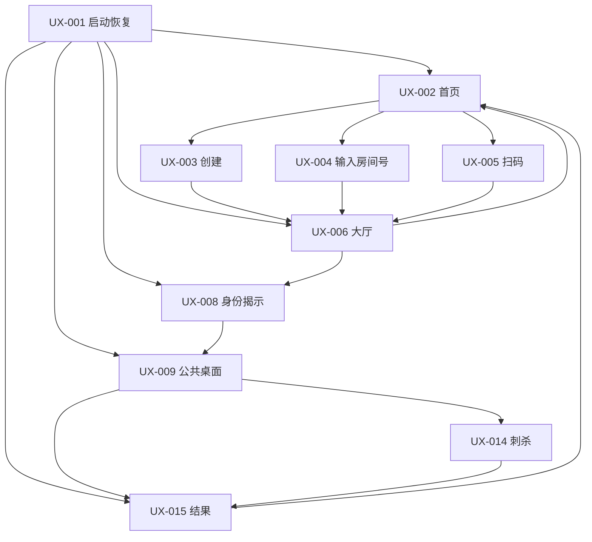

# Avalon 移动端 UX 交互规范

> 状态：P0 实现基线
>
> 平台：iOS、Android 手机竖屏
>
> 依赖：[FR/NFR](./mobile-fr-nfr.zh-CN.md) · [状态机](./server-state-machine.zh-CN.md) · [协议契约](./api-contract.zh-CN.md)
>
> 边界：本文确定信息层级、交互和状态，不确定品牌名称、Logo、插画风格或最终视觉资产。

## 1. 体验目标

应用应像一位克制、可靠的线下主持人：清楚告诉全桌当前发生什么，只在玩家自己的手机上呈现其秘密，并在讨论时尽量退居背景。

设计必须遵循：

1. **公开与私密一眼可辨。** 公共桌面和秘密操作使用不同的页头、背景提示与隐私标记；
2. **服务器状态可见。** 阶段、队长、任务、尝试、提交确认均来自服务端投影；
3. **危险动作有一次明确确认。** 投票、任务行动、刺杀、开局和关闭房间不可因误触提交；
4. **提交后不留秘密痕迹。** 任务选择提交后立即替换为中性等待页；
5. **音频永远有字幕。** 静音、音频失败和听障用户可完成全流程；
6. **断线不伪装成可操作。** 网络未知、暂停与过期必须覆盖动作入口，不使用本地乐观裁决；
7. **同桌可读。** 关键公共结果适合把手机放桌面查看，但绝不要求展示秘密身份页。

## 2. 信息架构与路由

### 2.1 页面 ID

| ID | 建议路由 | 页面 | 公开/私密 | 主要追踪 |
| --- | --- | --- | --- | --- |
| `UX-001` | 启动门 | 启动与会话恢复 | 私密系统态 | `FR-006`、`FR-042` |
| `UX-002` | `/(public)` | 首页 | 公开 | `FR-001`–`FR-004` |
| `UX-003` | `/(public)/create` | 创建房间 | 公开配置 | `FR-002` |
| `UX-004` | `/(public)/join` | 输入房间号 | 公开 | `FR-004`–`FR-005` |
| `UX-005` | `/(public)/scan` | 扫描二维码 | 相机输入 | `FR-004`、`NFR-011` |
| `UX-006` | `/(room)/lobby` | 房间大厅 | 公开 + 房主控制 | `FR-003`、`FR-007`–`FR-016` |
| `UX-007` | `/(room)/roles` | 角色配置 | 公开配置 | `FR-011`–`FR-013` |
| `UX-008` | `/(game)/role` | 身份隐私门与揭示 | 高度私密 | `FR-017`–`FR-020` |
| `UX-009` | `/(game)` | 公共对局桌面 | 公开骨架 | `FR-021`–`FR-031` |
| `UX-010` | 对局内 sheet | 组队 | 当前队长私密编辑、公开结果 | `FR-023` |
| `UX-011` | 对局内 sheet | 组队投票 | 私密输入、公开结算 | `FR-024`–`FR-026` |
| `UX-012` | 对局内全屏层 | 任务行动 | 高度私密 | `FR-027`–`FR-029` |
| `UX-013` | 对局内 sheet | 任务结果 | 公开 | `FR-029`–`FR-031` |
| `UX-014` | `/(game)/assassination` | 刺杀 | 刺客私密输入 | `FR-032`–`FR-033` |
| `UX-015` | `/(game)/result` | 最终结果 | 公开揭示 | `FR-034` |
| `UX-016` | 全局 overlay | 暂停与断线 | 公开系统态 | `FR-040`–`FR-047` |

路由只能表达当前位置，是否可进入和可执行动作始终由 `RoomView.private.availableActions` 决定。深链只允许落到加入页并预填房间号；不得以 URL 打开身份、任务或刺杀操作。

### 2.2 导航状态机



服务端投影与当前路由冲突时，客户端使用 `phase` 映射到规范页面并执行 replace，不把后退历史当作游戏状态。系统返回键不得回到过期秘密操作；活跃对局按返回键显示“留在对局/最小化应用”，不提供退出对局。

## 3. 全局界面框架

### 3.1 页面层级

```text
系统状态栏
应用页头：返回/房间号（适用时）/连接状态/房主音频入口
阶段上下文：任务、尝试、当前队长、比分
页面主内容
固定操作区：一个主动作，最多一个次动作
字幕条：仅有当前 audio cue 时出现
全局暂停/恢复遮罩：优先级最高
```

- 主动作始终使用文字动词，如“提交队伍”“确认同意”“继续到任务”；不得只用图标；
- 房间号可见但 `RoomId`、`PlayerId`、`stateVersion` 默认不展示；诊断抽屉可显示匿名诊断码和应用版本；
- 连接图标只表达“在线/正在恢复/已暂停”，不以绿色作为唯一信息；
- 房主控制与秘密角色权限分开呈现。房主不因主持身份获得刺客/队长动作；
- Toast 只用于非阻塞确认；会阻止提交或改变去向的错误必须就地或全屏展示。

### 3.2 视觉语义令牌

M0 应建立语义令牌，不在页面硬编码颜色：

| 令牌 | 用途 | 约束 |
| --- | --- | --- |
| `surface.public` | 大厅、公共桌面、结果 | 中性、适合全桌查看 |
| `surface.private` | 身份、投票、任务、刺杀输入 | 明显隐私标记，不单靠颜色区分 |
| `surface.blocking` | 暂停、断线、恢复 | 高层遮罩，禁用底层交互 |
| `text.primary/secondary/inverse` | 文本层级 | 满足 WCAG AA 对比度目标 |
| `action.primary/destructive/selected/disabled` | 操作状态 | 每种同时有形状/文字状态 |
| `result.success/failure/pending` | 任务与连接结果 | 配对图标和文字，不只使用红绿 |
| `focus.visible` | 键盘/辅助设备焦点 | 所有可交互元素可见 |

字体使用系统字体或完成商业授权的内置字体。正文在默认字号下不小于 16sp/pt；状态/辅助文字不小于 13sp/pt；动态字体最大档不得裁切关键按钮。

## 4. 页面规范

### 4.1 `UX-001` 启动与恢复

按以下顺序执行：加载本地非秘密设置 → 检查 SecureStore token → 有 token 则显示“正在恢复对局”并调用 `SM-003` → 根据投影 replace 到规范页面。恢复超过 8 秒显示“继续等待”和“清除本机失效会话”；只有明确 `SESSION_INVALID/ROOM_EXPIRED` 才自动清除。

不得在启动画面短暂闪现上次角色、房间成员或结果。无网络时显示最后公开状态的简化摘要，不显示缓存角色且不允许操作。

### 4.2 `UX-002`–`UX-005` 首页、创建与加入

首页第一焦点为昵称；本机可记住上次昵称，但必须可编辑。主入口为“创建房间”，次入口为“加入房间”，扫码与手输同级可替换。

创建页按“人数 → 角色预设 → 昵称”排列。自定义角色进入 `UX-007`，返回后显示配置摘要。提交期间按钮显示进度并禁用重复触发；幂等重试保持同一个键。

房间号输入使用 6 个可访问的单一输入语义而非 6 个独立焦点，自动大写并允许粘贴；视觉上分格显示。扫码页仅在可见时请求相机：

- 首次使用先显示用途说明，再触发系统权限；
- 拒绝后显示“打开设置”和“改用房间号”；
- 只接受应用允许的 HTTPS host 与 `/join/{roomCode}` 结构；
- 非法二维码不自动打开外部 URL。

### 4.3 `UX-006` 大厅

顶部始终显示大号房间号、复制按钮和全屏二维码。玩家列表按座次排列，每项含座次、昵称、房主标签、在线文字和准备状态。

普通玩家底部主动作是“我已准备/取消准备”。房主底部为“开始游戏”，并在禁用时列出完整原因：人数未满、玩家离线、未全员准备、配置不合法或音频包不兼容。

房主编辑行为：

- 调整座次使用可访问的“上移/下移”操作，同时可提供拖放；保存一次发送完整顺序；
- 移除玩家需确认并显示昵称；不得在确认文案中展示内部 ID；
- 配置变化成功后展示“配置已更新，请所有人重新准备”；
- 音频预检同时显示字幕、播放/停止和音量帮助，不改变房间状态。

全屏二维码页保持房间号文字、亮度提示和关闭按钮；禁止系统截图不是可靠安全边界，因为二维码本身是公开邀请。

### 4.4 `UX-007` 角色配置

预设以卡片呈现“经典”“常用角色”“自定义”，显示善/恶人数和角色列表。自定义按阵营分组，梅林与刺客为锁定必选，特殊角色使用单选开关，普通角色数量自动补足。

校验区实时列出所有错误而非一次只报一个；“保存配置”只有本地初筛合法时启用，服务器拒绝后以返回字段路径合并显示。角色说明可以公开阅读，但不得暗示实际发牌。

### 4.5 `UX-008` 身份隐私门与揭示

进入页面先显示不含角色的隐私门：

```text
私密信息
请遮挡屏幕并确认旁人无法看到。
[按住查看身份]
```

- 按住 600ms 后揭示，松开立即遮罩；同时提供无障碍可用的“点按揭示/再次点按隐藏”模式；
- 屏幕阅读器不得在进入页时自动朗读角色，只有用户激活揭示后才把焦点移到角色标题；
- 揭示内容依次为角色、阵营、能力、私密知识名单；名单只使用协议语义标签；
- “我已记住身份”二次确认后发送 `AckRole`，成功立即回到中性等待状态；
- 应用退到后台、系统截屏预览或录屏状态变化时立即遮罩。若平台不能阻止截屏，文案只提醒，不声称绝对防止；
- 身份页面不提供分享、复制、导出、朗读或可被通知预览的内容。

### 4.6 `UX-009` 公共对局桌面

桌面是所有阶段的稳定背景：五格任务轨道、善/恶比分、当前任务人数、1–5 组队尝试、座次环/列表、当前队长和获选队伍。复杂历史收进可展开“对局记录”，不挤压当前操作。

`HOST_HELD` 时显示讨论卡与主持字幕，普通玩家只有“等待房主继续”；房主看到明确下一阶段按钮。`COLLECTING` 时通过私密 sheet/全屏层承载动作；`RESOLVED` 时只展示已锁定结果和房主继续入口。

### 4.7 `UX-010` 组队

只有当前队长看到可选择玩家列表；页面明确“选择 X 人”。每个玩家项为独立复选，显示座次和昵称，不显示角色推断。达到人数后主按钮启用，点击打开确认 sheet，按座次列出队伍。

提交成功后所有设备在公共桌面突出显示拟议队伍并等待投票；失败保留选择草稿仅限字段校验错误，状态过期则清空草稿并返回最新桌面。

### 4.8 `UX-011` 组队投票

全员看到相同队伍摘要，各自在私密区域选择“同意”或“否决”。两个选项在文字、图标、形状和位置上区分；选择后仍需确认“确认提交同意/否决”。

提交成功立即隐藏本人选择，显示“你的投票已提交”和总进度，不显示具体未提交者。全员完成后公共结果按座次同时揭示每人票值，再显示总数、平票规则、通过/否决与下一队长。

### 4.9 `UX-012` 任务行动

进入前显示第二次隐私门。非队员只看到中性等待页；队员看到服务端给出的合法选项：善方只有“任务成功”，邪恶方有“任务成功/任务失败”。客户端不得通过禁用态渲染善方的失败选项。

确认 sheet 逐字重复选择并提醒提交不可修改。提交成功后卸载选择组件、清空草稿并显示中性等待，不回显选择图标、颜色或触觉差异。成功和失败提交使用相同长度/模式的动画与触觉，减少旁观侧信道。

### 4.10 `UX-013` 任务结果

只展示匿名成功/失败数量、所需失败阈值、任务结果和累计比分。7–10 人第四次任务在提交前及结算时都显示“双失败规则”，但不显示行动归属。结果动画在减少动态效果开启时替换为即时状态变化。

### 4.11 `UX-014` 刺杀

所有人先看到公开讨论等待页，不公开角色。只有服务端授权的刺客在 `COLLECTING` 后看到候选列表；候选包含除刺客本人外所有玩家，不按阵营分组或过滤。

选定后确认 sheet 显示“刺杀 X，提交后立即结束游戏”。提交期间全屏阻止重复点击；结果必须来自服务器。非刺客永远不加载或保留候选选择控件。

### 4.12 `UX-015` 最终结果

首屏展示胜方和四种规范胜因之一；下方按座次翻开全部角色，标出刺杀目标（适用时），再展示任务与组队公开历史。`ABORTED` 使用中性“对局中止”，不套用善恶胜利颜色或庆祝。

终局投影只保存在各客户端内存；服务端收到全部在线会话确认或 60 秒超时后清除房间。所有人可返回首页，本地清理投影、会话和音频状态后才完成导航。终局后断线不再恢复结果。MVP 不提供战绩保存、历史入口或公开分享卡。

### 4.13 `UX-016` 暂停、断线与错误

遮罩优先级：房间过期/会话失效 > 手动/连接暂停 > 正在恢复 > 普通内联错误。暂停遮罩展示公开原因、离线玩家、已保留时长/剩余窗口和允许动作。

- 断线不足 10 秒：页头显示“正在重新连接”，禁用秘密动作提交但不立即全屏打断讨论；
- 服务端确认暂停：全屏遮罩，底层不可访问；
- 房主离线：明确“不转移主持权限”；
- 手动暂停与离线原因并存：分别显示，只有所有原因清除才恢复；
- 恢复后回到服务端当前阶段，不自动打开上次 sheet、不自动播放语音；
- `STALE_VERSION`：显示“对局已更新”，清空未提交草稿并渲染新投影；
- 未知错误：提供重试与复制匿名诊断码，禁止复制请求体。

## 5. 房主语音与字幕

房主页头的音频入口打开控制 sheet：当前字幕、播放状态、音量、静音、重播。应用内音量不假装改变系统媒体音量；无法播放时提示检查系统音量并允许字幕继续。

| 情况 | 房主 | 普通玩家 |
| --- | --- | --- |
| 新 `LIVE audioCueId` | 自动播放一次 + 字幕 | 仅字幕 |
| 相同 cue 重复投影 | 不播放 | 字幕保持 |
| `RESYNC`/回前台 | 不播放，保留重播入口 | 字幕保持 |
| 主动重播新 ID | 播放一次 | 更新字幕，不播放 |
| 来电/闹钟打断 | 停止或暂停，返回后不自动继续 | 无变化 |
| 音频缺失/哈希失败 | 错误提示 + 字幕 | 字幕 |

动态昵称、玩家列表、票数和角色不得进入音频；字幕模板也不拼接秘密字段。音频资源清单在 P1 的 `audio-cues.zh-CN.yaml` 中确定。

## 6. 表单、确认与反馈

### 6.1 确认分级

| 级别 | 行为 | 模式 |
| --- | --- | --- |
| 普通 | 复制房间号、音量、展开历史 | 即时反馈，可逆 |
| 重要 | 准备、保存配置、调整座次 | 明确按钮，服务器成功后更新 |
| 不可逆秘密 | 投票、任务行动、刺杀 | 显式选择 + 逐字确认 + 提交后隐藏 |
| 对局生命周期 | 开始、移除玩家、关闭房间 | 确认 sheet，说明影响 |

所有提交按钮在等待 ack 时禁用并显示进度；超时不把按钮立即恢复为新命令，而是使用相同 `commandId` 查询/重试。成功状态以投影为准。

### 6.2 错误呈现

字段错误靠近字段并在页首提供摘要；权限/阶段错误触发重同步；房间终止使用全屏状态；音频错误不得阻塞规则流程。所有文案由稳定 ErrorCode 映射，诊断码可复制。

## 7. 可访问性

必须满足 `NFR-018`–`NFR-020`：

- iOS VoiceOver 与 Android TalkBack 的阅读顺序与视觉顺序一致；
- 每个玩家项以“座次、昵称、房主/队长、在线、准备、是否入队”的可读组合标签呈现；
- 任务轨道提供等价文本摘要，如“任务二失败，当前善方一分、邪恶方一分”；
- 动态字体最大档允许页面滚动，固定底栏不遮挡焦点；
- 主要触控区域至少 44×44 pt/dp，危险选择之间留足间距；
- 所有图标有可本地化标签，装饰插画从可访问性树移除；
- 颜色对比度以 WCAG 2.2 AA 为目标；关键信息有文字与图形冗余；
- 尊重 Reduce Motion、Bold Text、系统高对比度与静音设置；
- 二维码、拖放、音频和长按均有等价替代操作；
- 私密内容的辅助技术支持不能以“防窥”为由被整体禁用。

## 8. 隐私与安全 UX

- 操作系统任务切换器预览在身份、投票、任务和刺杀页使用中性遮罩；
- 通知只允许“对局等待你操作”等无秘密文本，锁屏不显示角色、票或房间成员；
- 剪贴板只用于房间号；token、内部 ID 和角色文本无复制入口；
- 应用内诊断导出采用字段允许列表，不含 roomCode、昵称、token、角色或选择；
- Android 截屏保护可作为私密页纵深防御；iOS/平台不保证处需使用遮罩和用户提示，不承诺绝对阻止；
- 应用在投影权限不明确时宁可显示恢复页，也不得展示缓存秘密；
- 分析埋点以页面/错误/耗时类别为粒度，禁止选择值和角色维度。

## 9. 设备与布局矩阵

MVP 只要求手机竖屏；横屏保持可用但可提示旋转。最小宽度以支持系统中最窄目标手机为准，不以固定像素布局。平板居中限制内容宽度，身份页不得扩大到易被旁观的全屏大字。

至少检查：小屏 + 最大字体、标准 iPhone、带安全区 iPhone、大/小 Android、浅色/深色（若 MVP 提供主题）、VoiceOver、TalkBack、静音、拒绝相机、网络切换、来电音频中断。

## 10. UX 验收矩阵

| UX 范围 | FR/NFR | AC | 必需证据 |
| --- | --- | --- | --- |
| 创建/加入/扫码 | `FR-001`–`FR-006`、`NFR-011`、`NFR-013` | `AC-013`、`AC-014` | 手输、合法/非法 QR、拒绝权限截图/录屏 |
| 大厅/配置 | `FR-007`–`FR-016` | `AC-001` | 5/10 人、配置错误、房主/普通视角 |
| 身份揭示 | `FR-017`–`FR-020`、`NFR-014` | `AC-008`、`AC-015` | 每类知识视角、后台遮罩、读屏 |
| 组队/投票 | `FR-021`–`FR-026` | `AC-002`–`AC-004` | 平票、五拒、提交后中性态 |
| 任务/刺杀 | `FR-027`–`FR-034` | `AC-005`–`AC-007` | 善恶选项、双失败、刺杀两结果 |
| 音频 | `FR-035`–`FR-039`、`NFR-015`、`NFR-021` | `AC-012` | 首播、重连不播、主动重播、资源损坏 |
| 暂停恢复 | `FR-040`–`FR-047`、`NFR-005`–`NFR-007` | `AC-009`–`AC-011` | 10 秒暂停、多原因、过期、旧版本 |
| 无障碍 | `NFR-018`–`NFR-020` | `AC-014` | 最大字体、读屏、无声、非颜色表达 |

## 11. 开发前仍需人工确认的视觉项

以下不阻塞 M0 架构和组件骨架，但应在 M1 前确认，以免大规模返工：产品正式名称与 bundle display name、品牌色/明暗主题策略、原创角色美术方向、字体与音频声音授权、是否允许公开分享应用加入链接。
