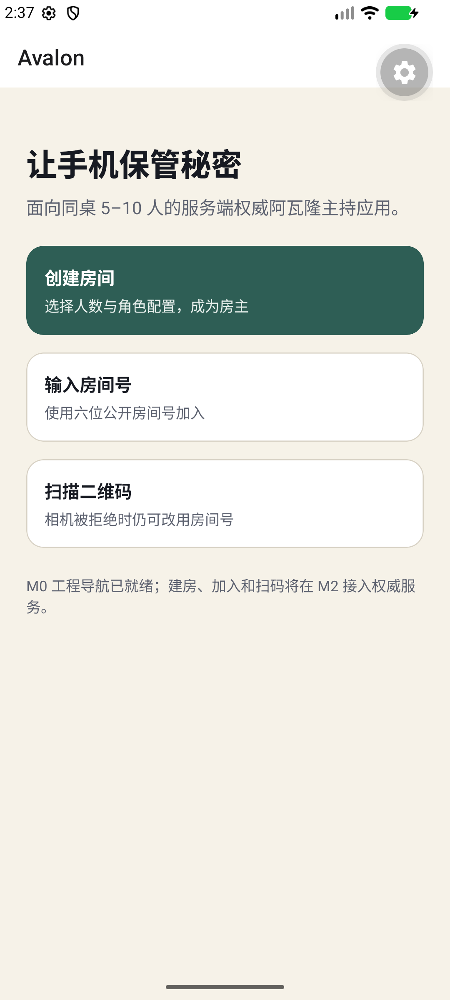
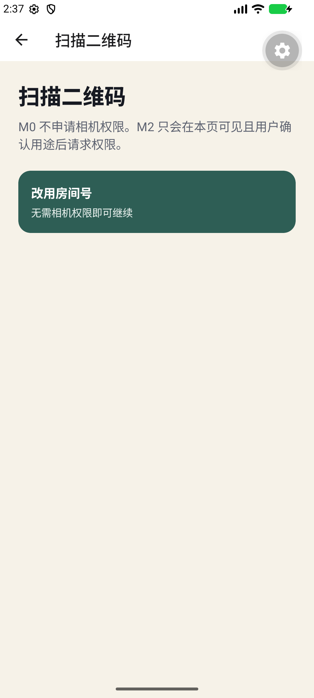
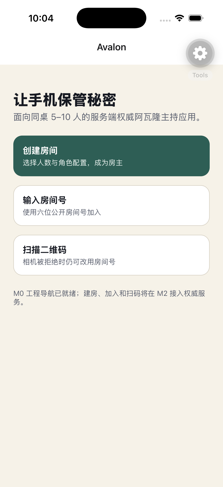
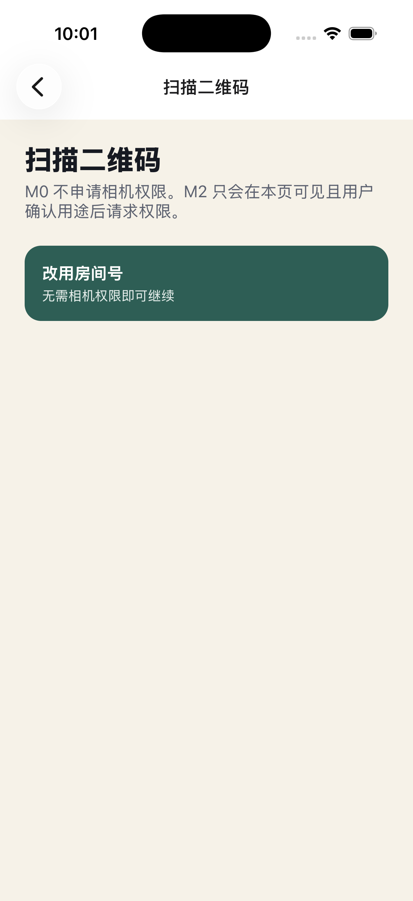

# M0 本地验证证据

> 日期：2026-08-13（Australia/Sydney）
>
> 范围：`M0-001`–`M0-009`、`ADR-005`、`TEST-contract`、`NFR-014`

## Android Development Build

- 环境：Apple Silicon macOS、OpenJDK 17.0.20、Android SDK 36 compile target、Medium Phone API 37 arm64 模拟器；
- 构建：`CI=1 npx expo run:android --no-bundler`，Gradle `BUILD SUCCESSFUL`，debug APK 已安装到 `com.example.avalon.dev`；
- 冒烟：本地 Development Build 连接 Metro 后，`pnpm test:e2e:mobile` 使用 Maestro 2.8.0 通过首页、创建页、返回、扫码页导航；同时确认创建/加入/扫码均暴露为可访问按钮，扫码页可在不申请相机权限时进入房间号降级路径；
- 秘密检查：截图和 UI 树不含会话令牌、房间秘密、角色或真实玩家数据。

正常首页：

无相机权限降级页：

## iOS Development Build

- 环境：Xcode 26.6（17F113）、Swift 6.3.3、iOS 26.5 Simulator、iPhone 17 Pro；CocoaPods 1.17.0；
- 预构建：`CI=1 npx expo prebuild --clean --no-install` 通过；
- 构建：`CI=1 npx expo run:ios --device 16DCB0B8-5A51-48FB-89BB-01458D3C354B --no-bundler` 以 0 errors 完成，Development Build 已安装并打开到 `com.example.avalon.dev`；
- 冒烟：Development Build 连接 Metro 后，`pnpm test:e2e:mobile` 使用 Maestro 2.8.0 通过首页、创建页、原生返回、扫码页和房间号降级路径；
- 环境说明：仓库位于 iCloud 同步的 `Documents` 时，File Provider 会给生成的 `ExpoModulesJSI.framework` 附加 FinderInfo，导致 codesign 报 `resource fork, Finder information, or similar detritus not allowed`。同一工作树源码复制到不受同步的临时目录后干净安装、CNG 预构建与原生构建通过；没有修改 `node_modules`、Pods 或生成 Framework 绕过签名检查。

正常首页：

无相机权限降级页：

## 自动化检查

| 命令                                        | 结果                                                                  |
| ------------------------------------------- | --------------------------------------------------------------------- |
| `pnpm format:check`                         | 通过                                                                  |
| `pnpm lint`                                 | 通过                                                                  |
| `pnpm typecheck`                            | 通过                                                                  |
| `pnpm test`                                 | 通过：11 个单元测试                                                   |
| `pnpm test:contract`                        | 通过：52 个协议正反例                                                 |
| `pnpm test:integration`                     | 通过：Testcontainers PostgreSQL/Redis                                 |
| `pnpm test:e2e:mobile`                      | Android API 37 与 iOS 26.5 均通过                                     |
| `pnpm build`                                | 通过：Expo Android/iOS/Web bundle 与全部 TypeScript workspace         |
| `pnpm docs:check`                           | 通过：Schema 生成无漂移、22 个 Markdown 文件与追踪区间                |
| `pnpm secret:scan`                          | 通过                                                                  |
| `docker build -f apps/server/Dockerfile -t avalon-server:m0 .` | 通过；容器以非 root 用户启动                               |
| 本地 Compose + migration + health + 50 请求 | 通过；`live/ready` 无配置泄漏，最终健康请求 p95 为 14.6 ms            |
| `npx expo-doctor@latest apps/mobile`        | 通过：21/21                                                           |
| `npx expo run:ios ...`                      | 通过：Xcode 26.6，0 errors；应用已安装并打开到 iOS 26.5 模拟器         |

最终门禁使用 Node 24.19.0 与 pnpm 11.16.0；`.node-version`、根 `engines`、CI 与服务端镜像保持一致。
